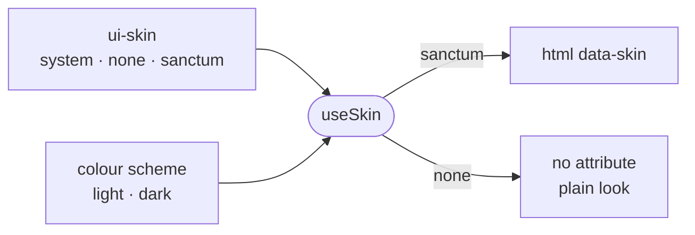

# skins

A skin is the editor's whole look, worn as one `data-skin` attribute on `<html>`; this directory holds the skin's stylesheet, the preference that picks it, and the wallpapers behind the agents board and a few extension pages.

```mermaid
flowchart LR
    choice["ui-skin<br/>system · none · sanctum"] --> skin(["useSkin"])
    scheme["colour scheme<br/>light · dark"] --> skin
    skin -->|"sanctum"| attr["html data-skin"]
    skin -->|"none"| plain["no attribute<br/>plain look"]
```

- `sanctum.css` scopes every rule to `[data-skin="sanctum"]` and is imported by `src/styles.css`, so the skin
  `none` needs no stylesheet: it writes no attribute and the app shows its plain look.
- The setting is stored under `ui-skin` and holds `system`, `none` or `sanctum`. `system` is the default and
  follows the colour scheme: dark wears `sanctum`, light wears `none`, and an OS that flips at dusk carries the
  look with it.
- Sanctum is built on a near-black canvas and has no daylight dress. Pinning it with `setSkin("sanctum")` also
  sets the scheme to dark. Settings offers it as one of four looks on the theme row (`themeRow.ts`) rather than
  as its own control, since two controls could put a light scheme under a dark skin.
- `index.html` runs the same rule in its pre-paint script, so the attribute is in place before the bundle loads
  and there is no flash of the plain look. Anything that needs a fixed look, such as a profile link or the
  screenshot tooling, writes `ui-skin` and `ui-color-scheme` before boot.
- A new skin needs its name in `Skin` and `isSkin`, a stylesheet scoped to its attribute, a line in the
  pre-paint script, and a place on the theme row.

## Wallpapers

A wallpaper is a picture behind the agents board and the full-width card pages named in `WALLPAPERED_EXTENSIONS`
(`/ext/workflows`, `/ext/automations`, `/ext/projects`, `/ext/pipelines`), picked on its own row in Appearance and worn under any of
the four looks. `useWallpaper.ts` stores it under `ui-wallpaper` (`none` or `mist`, `none` by default) and writes it as
`data-wallpaper` on `<html>`; `wallpapers.css` draws it as the backgrounds of `.agents-board`, and of the shell's
main scroller (`.wallpaper-surface`, set by `useWallpaperedRoute`) on those pages, so the picture stays put while the
page scrolls. The scheme picks each picture's dark or light version and its scrims, and every picture is toned the
same way: dimmed by a veil that keeps its own hue (warm paper by day, dark by night), never desaturated, which read as grey. While one is worn the board's lane headers drop their
canvas band and stop pinning, since a pinned header with nothing behind it would slide over the cards under it.

- A picture's masters are `src/assets/wallpaper/<name>-dark.png` and `<name>-light.png`, 16:9;
  `pnpm --filter @intentic/web wallpaper:art` encodes every master into the AVIF rungs under
  `public/assets/wallpaper/`, which are committed.
- A new wallpaper needs its masters, its name in `WALLPAPERS`, its `--wallpaper-art` rules in `wallpapers.css` and
  a `settings.appearance.wallpaper.<name>` label in every locale.

## Key files

- [useSkin.ts](useSkin.ts) — the preference, the rule that resolves `system`, and the dark pin.
- [sanctum.css](sanctum.css) — the one skin, as role tokens and surfaces under `[data-skin="sanctum"]`.
- [../features/settings/themeRow.ts](../features/settings/themeRow.ts) — how the four looks map onto scheme and skin.
- [useWallpaper.ts](useWallpaper.ts) — the wallpaper preference and the attribute it writes.
