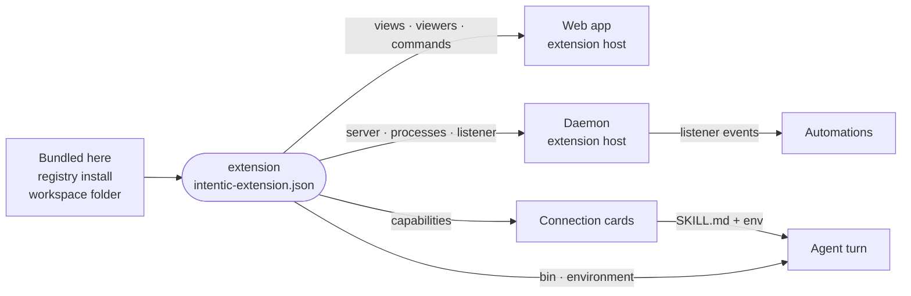

# Extensions

The first-party extensions that sit on the lean core: the panels, connection cards, chat providers and messaging gateways, each declared by one `intentic-extension.json`.

- The manifest is the approval surface: the install dialog shows it, and the host refuses any registration or daemon route it does not declare. Its schema is [extension-manifest](../_shared/extension-manifest), the runtime API is [extension-api](../_shared/extension-api), and [extension-example](../_tools/extension-example) carries one contribution of every kind.
- UI extensions compile into the web bundle ([builtins.ts](../_editor/web/src/extension-host/builtins.ts)) and bake only their manifest into the sandbox image, so the Extensions tab lists them beside every other extension with one on/off switch.
- Data-only packs (cards, skills, Dockerfile fragments) copy into the image as they are. Gateway extensions bake their manifest everywhere and ship their runnable tree in the `messaging` image pack.
- Optional first-party extensions live in their own repositories and install from the registry like third-party ones. The daemon ([src/extensions](../_sandbox/sandbox/src/extensions)) enumerates baked, git-installed and workspace extensions as one list.

| Package | Role |
| --- | --- |
| [acp-agents](acp-agents) | Chat-provider cards for OpenCode, Gemini CLI and any ACP agent. |
| [activity](activity) | Sandbox tab auditing what reached the agent and how it went. |
| [approvals](approvals) | Inbox of posts, actions, held wakes and hooks awaiting the owner. |
| [automations](automations) | Rail view to create and watch the agent's scheduled and triggered wake-ups. |
| [browsers](browsers) | Cards connecting the owner's own Chrome or Edge. |
| [connectors](connectors) | CLI and browser cards: GitHub, GitLab, Sentry, Postgres and more. |
| [devices](devices) | Cards pairing the owner's Windows or Linux machine. |
| [discord](discord) | Discord bot card, message listener and voice-transcribing gateway. |
| [git-history](git-history) | Per-repository commit graph with branch, stash and undo actions. |
| [google-workspace](google-workspace) | `gw` CLI for Gmail, Calendar, Drive, Docs and Sheets, plus a watcher. |
| [imap](imap) | IMAP inbox card and a mailbox watcher that wakes automations. |
| [onlyoffice](onlyoffice) | Office documents in an ONLYOFFICE editor, with a daemon-run backend. |
| [pi-agent](pi-agent) | The Pi coding agent as a chat provider. |
| [pipelines](pipelines) | Rail view of CI runs on the workspace repositories' remotes. |
| [preview](preview) | Sandbox tabs for exposed ports and the served `public/` directory. |
| [projects](projects) | The workspace's repositories as a dashboard of tiles. |
| [repo-apps](repo-apps) | Per-repository panels for a monorepo's apps, tests and dependencies. |
| [slack](slack) | Slack card plus a Socket Mode gateway. |
| [social](social) | Browser cards for acting as the owner on Reddit, X and YouTube. |
| [telegram](telegram) | Telegram bot card plus a long-polling gateway. |
| [viewers](viewers) | File viewers for images, PDF, media, office formats and EPUB. |
| [whatsapp](whatsapp) | WhatsApp linked-device card plus its gateway. |
| [workflows](workflows) | Rail view of workflows: graphs of agent sessions with declared outputs. |
