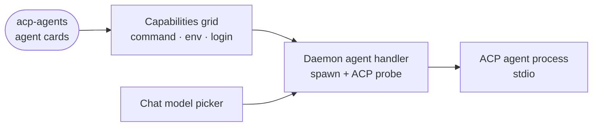

# acp-agents

A data-only extension that adds connection cards for running OpenCode, Gemini CLI or any Agent Client Protocol agent as a chat provider.

- Holds no code: the manifest declares three `agent`-kind cards (`opencode`, `gemini`, `acp-agent`) and their form fields, and the daemon's generic agent handler does the rest.
- Adding a card spawns the command and runs an ACP `initialize` probe, so a command that does not speak ACP fails at the card with its stderr, before any chat depends on it. The agent then appears as a provider in the chat's model picker.
- The agent runs inside the sandbox over stdio and keeps its own credentials: an `env` block for API keys, or a `loginCommand` the owner runs once in a Terminal.
- The extension installs nothing: the command must already be on the sandbox PATH.
- Baked into every sandbox image; switching it off on the Extensions tab removes exactly these cards.

## Key files

- [intentic-extension.json](intentic-extension.json) — the three cards, their defaults and setup hints.
- [../../_sandbox/sandbox/src/capabilities/handlers/agent.handler.ts](../../_sandbox/sandbox/src/capabilities/handlers/agent.handler.ts) — what adding a card does: spawn and probe.
- [../../_sandbox/sandbox/src/runtimes/acp/acp-adapter.ts](../../_sandbox/sandbox/src/runtimes/acp/acp-adapter.ts) — serves chat turns for any provider that is an installed `agent` card.
