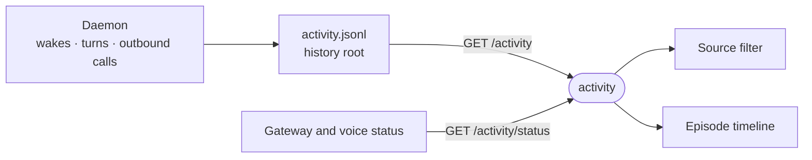

# activity

The Activity tab on the Sandbox hub: a read-only audit feed of what woke the agent, which provider calls it made and how each turn went.



- Runs in the browser, compiled into the web bundle as a first-party extension. It has no backend: the daemon writes the log in [activity-store.ts](../../_sandbox/sandbox/src/activity/activity-store.ts), outside `/work`, so the agent can neither read nor rewrite its own trail.
- `episodes.ts` folds the event-per-append log into episodes (one turn, message or event) and sources (who set it off: a connection or the owner typing). Pure functions, tested without Vue.
- Pages back through the log as far as the chosen time window needs, up to the daemon's prune ceiling. It never polls: the daemon's `activity` push refreshes the feed, and writes to `automations.json` or extension enablement refresh the status.
- It sits on the Sandbox hub and never badges, since an always-moving feed would keep the rail lit.

## Key files

- [src/extension.ts](src/extension.ts) — registers the view on the `sandbox` surface.
- [src/useActivity.ts](src/useActivity.ts) — paged feed query, live status and window coverage.
- [src/episodes.ts](src/episodes.ts) — events to episodes and sources.
- [src/ActivityView.vue](src/ActivityView.vue) — the tab: filters in the URL, source rail, timeline.
- [intentic-extension.json](intentic-extension.json) — the two routes it may read and the files that invalidate it.

## Commands

```sh
pnpm --filter @intentic/ext-activity test
```
