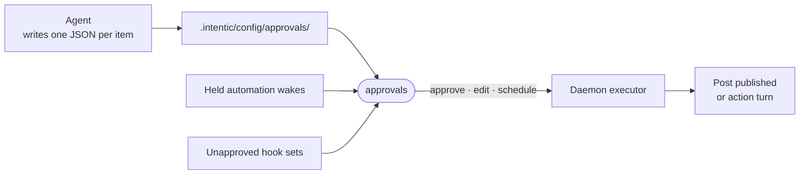

# approvals

The Approvals rail view: the owner's inbox for everything the agent prepared but may not do unasked, from posts and actions to held automation wakes and workspace hooks.



- Runs in the browser, compiled into the web bundle. The daemon owns the rest: [approvals-executor.ts](../../_sandbox/sandbox/src/approvals/approvals-executor.ts) fires each approved item at its due time, posting to Discord directly and handing every other post or action to a fresh agent turn.
- An item moves proposed → approved → running → done or failed. Approving starts a short hold with a live countdown and a way to call it back; rejecting deletes the file.
- Posts are editable in place before approval, with a length count against the platform's limit. Platform names and logos come from the enabled extensions' catalogs.
- The rail badge counts proposals owing a decision, held wakes with no deadline and hook sets waiting for a yes. A background poll keeps it current while the view is closed, since hook sets live outside `/work` and no file write announces them.
- Below the maintainer role the queue is read-only.

## Key files

- [src/extension.ts](src/extension.ts) — registers the rail view and its `approvalsAttention` badge.
- [src/ApprovalsView.vue](src/ApprovalsView.vue) — the inbox: sections by what is owed, countdown strip, bulk approve.
- [src/useApprovals.ts](src/useApprovals.ts) — the queue query, upsert-by-id and reject.
- [src/useHeldWakes.ts](src/useHeldWakes.ts) — automation wakes parked for approval.
- [src/usePostEdit.ts](src/usePostEdit.ts) — in-place post editing, saved as typed.

## Commands

```sh
pnpm --filter @intentic/ext-approvals test
```
