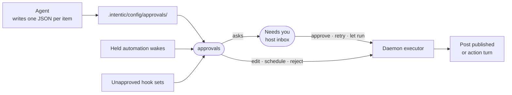

# approvals

The Approvals rail view: the queue of everything the agent prepared but may not do unasked, from posts and actions to held automation wakes and workspace hooks, whose decisions wait in the host's Needs you inbox.


```mermaid
flowchart LR
    agent["Agent<br/>writes one JSON per item"] --> dir[".intentic/config/approvals/"]
    dir --> view(["approvals"])
    held["Held automation wakes"] --> view
    hooks["Unapproved hook sets"] --> view
    view -->|"asks"| inbox(["Needs you<br/>host inbox"])
    inbox -->|"approve · retry · let run"| daemon["Daemon executor"]
    view -->|"edit · schedule · reject"| daemon
    daemon --> out["Post published<br/>or action turn"]
```

- Runs in the browser, compiled into the web bundle. The daemon owns the rest: [approvals-executor.ts](../../_sandbox/sandbox/src/approvals/approvals-executor.ts) fires each approved item at its due time, posting to Discord directly and handing every other post or action to a fresh agent turn.
- An item moves proposed → approved → running → done or failed. Approving starts a short hold with a live countdown and a way to call it back; rejecting deletes the file.
- Posts are editable in place before approval, with a length count against the platform's limit. Platform names and logos come from the enabled extensions' catalogs.
- Every decision it is owed is an ask (`ViewRegistration.asks`, [src/asks.ts](src/asks.ts)) in the host's Needs you inbox, beside what agents are waiting on: a proposal to approve, a failure to retry, a hook set to let run or keep off, and a record that could not be read. The inbox carries the one count, so this tile badges nothing of its own (2026-09-30: its count and the inbox's were two numbers for one question, and each page sent the reader to the other). Held wakes are not asked here: the host lists those from the board's own read. A background poll keeps the asks current while the view is closed, since hook sets live outside `/work` and no file write announces them.
- Editing, scheduling, rejecting, calling back a hold and the history stay on this page, which each ask opens on its slice.
- Below the maintainer role the queue is read-only, and asks nothing of that reader.
- What an agent asks while it works (a permission, a question, a plan) is not this queue's; it waits in Needs you too, and the empty page links there rather than reading as if nothing waited anywhere.

## Key files

- [src/extension.ts](src/extension.ts) — registers the rail view, the `approvalsAttention` poll and the asks read off it.
- [src/asks.ts](src/asks.ts) — what the queue asks of a person, item by item, for Needs you.
- [src/ApprovalsView.vue](src/ApprovalsView.vue) — the queue: sections by what is owed, countdown strip, bulk approve.
- [src/useApprovals.ts](src/useApprovals.ts) — the queue query, upsert-by-id and reject.
- [src/useHeldWakes.ts](src/useHeldWakes.ts) — automation wakes parked for approval.
- [src/usePostEdit.ts](src/usePostEdit.ts) — in-place post editing, saved as typed.

## Commands

```sh
pnpm --filter @intentic/ext-approvals test
```
