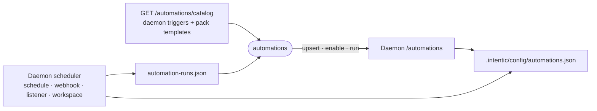

# automations

The Automations rail view, where the owner creates, edits and watches the agent's wake-ups: a trigger, an optional guard and the prompt the agent wakes with.



- Runs in the browser, compiled into the web bundle. The daemon fires every automation and records its runs ([src/automations](../../_sandbox/sandbox/src/automations)); this view only reads and writes the definitions through the `/automations` routes.
- Names no integration itself. The trigger picker and template gallery come from one catalogue read, which merges the daemon's own triggers with the listener sources and `automationTemplates` of every enabled extension. An automation whose extension is gone degrades to a generic, still-editable source.
- Schedules are edited as a structured form ([cronSchedule.ts](src/cronSchedule.ts)) that composes and parses cron. Webhook and Visitor chat automations hand over what to paste after saving: the tokened URL or the site snippet.
- Held wakes (`requireApproval`, `holdForSeconds`) belong to [approvals](../approvals), so this view carries no badge.

## Key files

- [src/AutomationsView.vue](src/AutomationsView.vue) — the page: standing rows, chores, offers and inline editing.
- [src/useAutomations.ts](src/useAutomations.ts) — queries and mutations over the daemon's automation routes.
- [src/catalog.ts](src/catalog.ts) — the trigger and template catalogue, with connected-state per capability.
- [src/useAutomationForm.ts](src/useAutomationForm.ts) — one form for create and edit; `load` and `build` round-trip.
- [src/AutomationComposer.vue](src/AutomationComposer.vue) — the inline composer and template gallery.

## Commands

```sh
pnpm --filter @intentic/ext-automations test
```
