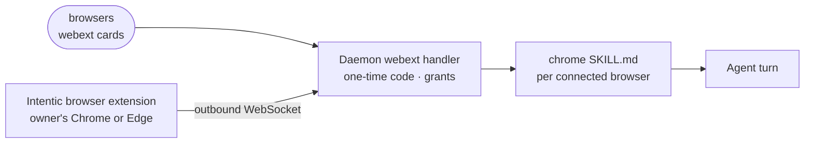

# browsers

A data-only extension that adds the "Your Chrome" and "Your Edge" connection cards, which let the agent work in the owner's own signed-in browser.

- For sites the sandbox's own browser cannot reach: passkeys, work SSO, a bank, a datacentre-blocked site. Nothing is copied out of the browser; the agent acts in it while the owner can watch.
- Holds no code. The manifest declares two `webext`-kind cards with their store links and setup steps; the daemon's generic peer handler pairs the browser with a one-time code and writes the skill.
- The far end is the browser extension in [_devices/webext](../../_devices/webext), which connects out to the sandbox and enforces per-site grants through the browser's own permission prompts.
- Both cards share [skills/chrome/SKILL.md](skills/chrome/SKILL.md), templated per connected browser; it tells the agent when to use this browser instead of the sandbox's.

## Key files

- [intentic-extension.json](intentic-extension.json) — the two cards, their install links and guides.
- [skills/chrome/SKILL.md](skills/chrome/SKILL.md) — the agent's instructions for a connected browser.
- [../../_sandbox/sandbox/src/capabilities/handlers/webext.handler.ts](../../_sandbox/sandbox/src/capabilities/handlers/webext.handler.ts) — pairing, grants and connection status for a `webext` card.
