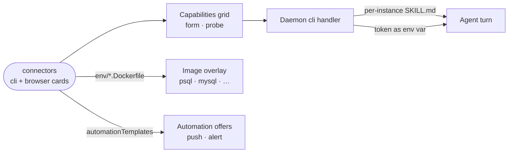

# connectors

A data-only extension that adds the first-party connection cards for developer and business services, from GitHub and Sentry to Postgres and Stripe, each with its agent skill.

- Holds no code. Every entry under `contributes.capabilities` is one card: its form fields, an `env` template, an optional `probe` that checks the credential reaches the service, and the `skills/<id>/SKILL.md` the agent reads once it is connected.
- Most cards are `cli` kind: the daemon injects the credential into the agent's environment each turn, suffixed with the instance id so two accounts of one service coexist, and never writes it to a file. `npmjs` and `website` are `browser` kind: a signed-in session in the sandbox's own browser.
- Cards that need a client tool (`postgres`, `mysql`, `posthog`) name a Dockerfile fragment in `env/`, restricted to `RUN` and `ENV` and built into the sandbox's image overlay.
- The manifest also offers automation templates tied to these cards: push webhooks for GitHub and GitLab, Sentry and Komodo alerts.
- Baked into every sandbox image; switching it off on the Extensions tab removes exactly these cards.

## Key files

- [intentic-extension.json](intentic-extension.json) — every card, its fields, env, probe and skill, plus the automation templates.
- [skills/github/SKILL.md](skills/github/SKILL.md) — a typical connector skill, templated per connected instance.
- [env/postgres.Dockerfile](env/postgres.Dockerfile) — a client-tool fragment for the image overlay.
- [../../_sandbox/sandbox/src/capabilities/handlers/cli.handler.ts](../../_sandbox/sandbox/src/capabilities/handlers/cli.handler.ts) — the generic handler every `cli` card runs through.
