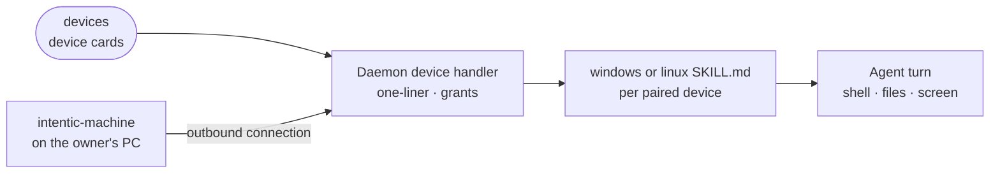

# devices

A data-only extension that adds the "Windows PC" and "Linux PC" connection cards, which pair the owner's own machine so the agent can work on it.

- Holds no code. The manifest declares two `device`-kind cards; adding one hands the owner a one-line install command for that machine, and the daemon's generic peer handler writes the skill and pushes the granted permissions once it connects.
- The far end is the device agent in [_devices/machine](../../_devices/machine). It connects outbound, so the owner opens no port and needs no VPN, and it enforces the grants on the device.
- The two skills differ by operating system: [windows](skills/windows/SKILL.md) teaches PowerShell quoting and paths, [linux](skills/linux/SKILL.md) sudo, the desktop session and WSL. Each is templated with the device's name, which is how the owner refers to it in chat.
- Baked into every sandbox image; switching it off on the Extensions tab removes exactly these cards.

## Key files

- [intentic-extension.json](intentic-extension.json) — the two cards and their setup guides.
- [skills/windows/SKILL.md](skills/windows/SKILL.md) — the agent's instructions for a paired Windows machine.
- [skills/linux/SKILL.md](skills/linux/SKILL.md) — the same for Linux.
- [../../_sandbox/sandbox/src/capabilities/handlers/device.handler.ts](../../_sandbox/sandbox/src/capabilities/handlers/device.handler.ts) — pairing, grants and status for a `device` card.
