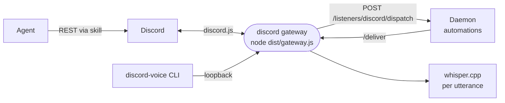

# discord

The Discord connection: a bot-token card and skill for the agent, plus a gateway process that turns server messages and voice calls into automation events.



- The card is a `cli` capability: the bot token reaches the agent's environment, and [the skill](skills/discord/SKILL.md) teaches it the Discord REST API with `curl`, including generating the invite link for the owner's server.
- The gateway is an `autoStart` extension process the daemon supervises while a Discord card or listener automation wants it. It holds one discord.js client per bot token and posts each human message to the daemon's listener route. On a mention it streams the automation's reply back into the channel as live edits. The daemon itself holds no Discord connection.
- Voice runs in the gateway so a call outlives any single turn. The agent joins and leaves with `discord-voice` (on its PATH via `contributes.bin`); each utterance is transcribed locally with whisper.cpp from the `whisper` image pack and dispatched as `voice_utterance`, and the finished transcript lands under `.intentic/records/artifacts/voice/`.
- Only the manifest is in every image. The built gateway ships in the `messaging` image pack; on a core image the card says the runtime is not included.
- Reconcile, status and shutdown come from [connector-runtime](../../_shared/connector-runtime); this package is only what is Discord-specific.

## Key files

- [src/gateway.ts](src/gateway.ts) — the process entry: reconcile hooks, delivery, loopback voice routes.
- [src/listener.ts](src/listener.ts) — messages to listener events, and the live reply painter.
- [src/voice.ts](src/voice.ts) — the voice session: capture, transcribe, dispatch, write the transcript.
- [src/audio.ts](src/audio.ts) — PCM resampling, WAV framing and the serialized whisper queue.
- [bin/discord-voice](bin/discord-voice) — the agent's join, leave and status command.
- [intentic-extension.json](intentic-extension.json) — the card, the listener events and the gateway process.

## Commands

```sh
pnpm --filter @intentic/ext-discord build   # tsc to dist/, which the process runs
pnpm --filter @intentic/ext-discord test
```
