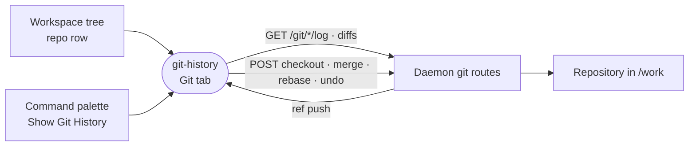

# git-history

The Git tab of a repository's panel: its commit graph across every ref, with branch, tag, stash, merge, rebase and undo actions on it.



- Runs in the browser, compiled into the web bundle. Every git operation is a daemon route listed in the manifest's `permissions.sandbox`; the extension never touches the repository itself.
- Registered as an auxiliary `directory` view, so every repository gets the tab without starving views that serve only unclaimed ones. The workspace root has no tree row, so a `documents` entry and the `git-history.open` command open its history instead.
- Clicking a file in a commit opens its diff in the editor's companion pane, from a repository panel and the root's document alike, so the graph stays on screen. A click peeks and a double-click keeps the tab.
- Uncommitted work draws as an ordinary row parented to `HEAD`, and stashes splice in above the commit they were taken on, so the lane layout handles both without special cases.
- Undo walks the branch back over its last move and leaves already-fixed files alone; Checkpoints restore the working tree instead. A halted merge or rebase left by a terminal shows with a way out.
- History loads page by page as the graph scrolls; search covers only loaded pages.

## Key files

- [src/extension.ts](src/extension.ts) — the per-repository view, the root document and the palette command.
- [src/GitHistoryTab.vue](src/GitHistoryTab.vue) — the graph, inline commit detail, diffs and the context menu.
- [src/graphLayout.ts](src/graphLayout.ts) — pure lane and colour geometry for the graph.
- [src/useGitLog.ts](src/useGitLog.ts) — the paged log query and lazy per-commit detail.
- [src/useUndo.ts](src/useUndo.ts) — the last branch-moving action and its reversal.

## Commands

```sh
pnpm --filter @intentic/ext-git-history test
```
