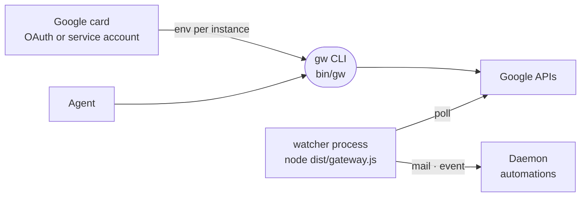

# google-workspace

The Google Workspace connection: one card that gives the agent `gw`, a CLI for Gmail, Calendar, Drive, Docs, Sheets and Contacts, plus a watcher that wakes automations on new mail and upcoming meetings.



- `gw` reaches the agent's PATH through `contributes.bin`. Its router picks the account, applies the read-only switch and formats failures once; each command in `src/services/` is only the API call and its output. Several accounts can be connected, and a company connection can act as anyone in the domain with `--as`.
- Read-only is enforced twice: the card asks Google for read scopes, and every command marked `writes` is refused by the router.
- Access tokens are cached per credential fingerprint in a `0600` file under the workspace runtime tree, since each `gw` call is a fresh process.
- The watcher polls because Gmail push needs a public endpoint the sandbox lacks. Mail follows Gmail's `history.list` cursor; calendar looks a short window ahead. A watermark file per connection means a restart neither replays the inbox nor skips mail. It runs only while an automation listens to `google`.
- The manifest ships a "Morning brief" automation template. The built tree ships in the `messaging` image pack; a core image has only the card.

## Key files

- [src/cli.ts](src/cli.ts) — the `gw` router: account choice, write guard, error output.
- [src/cli/command.ts](src/cli/command.ts) — a subcommand as data: run, help and `writes`.
- [src/google/accounts.ts](src/google/accounts.ts) — connected accounts read from the per-instance env vars.
- [src/gateway.ts](src/gateway.ts) — the watcher process: one poller per connected account.
- [src/watch/poller.ts](src/watch/poller.ts) — Gmail history and calendar window polling.
- [intentic-extension.json](intentic-extension.json) — the card, listener events, watcher process and template.

## Commands

```sh
pnpm --filter @intentic/ext-google-workspace build   # tsc to dist/, which bin/gw and the watcher run
pnpm --filter @intentic/ext-google-workspace test
```
