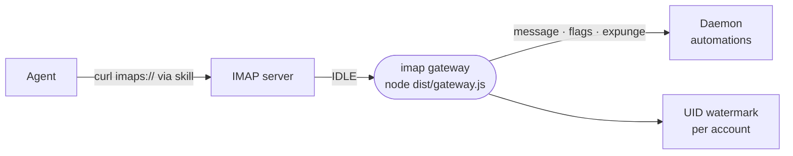

# imap

The IMAP connection: an email card whose skill lets the agent read the inbox with `curl`, plus a gateway that watches the mailbox and wakes automations when mail arrives.



- The card is a `cli` capability: host, port and credentials reach the agent's environment, and [the skill](skills/imap/SKILL.md) covers listing, searching and fetching with `curl` over `imaps://`.
- The gateway is an `autoStart` extension process holding one imapflow connection per account. It opens the watched mailbox read-only, catches up from its persisted UID watermark, then IDLEs and dispatches normalized events to the daemon's listener route.
- The watermark survives restarts, so mail that arrived while the gateway was down is delivered on reconnect. A changed `UIDVALIDITY` or mailbox re-baselines without replaying history.
- A bad credential is fatal until the card is edited, since providers lock accounts after repeated failed logins.
- Events carry a bounded text excerpt and attachment names; the agent fetches the full message by `extra.uid`. The manifest also offers a "New email" automation template.
- Only the manifest is in every image; the built gateway ships in the `messaging` image pack.

## Key files

- [src/gateway.ts](src/gateway.ts) — the process entry: reconciles one connection per account.
- [src/connection.ts](src/connection.ts) — one account's lifecycle: connect, catch up, IDLE.
- [src/normalize.ts](src/normalize.ts) — IMAP events to listener messages, pure and tested.
- [src/watermark.ts](src/watermark.ts) — the per-account resume point on disk.
- [intentic-extension.json](intentic-extension.json) — the card, listener events, gateway process and template.

## Commands

```sh
pnpm --filter @intentic/ext-imap build   # tsc to dist/, which the process runs
pnpm --filter @intentic/ext-imap test
```
