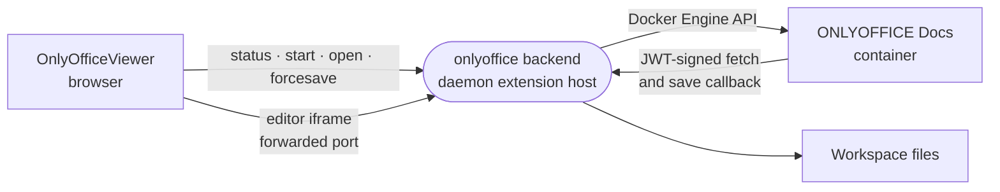

# onlyoffice

Opens Word, spreadsheet and presentation files from the workspace in a full ONLYOFFICE Docs editor that runs as a container inside the sandbox.



- Contributes one `office` viewer for the formats in `src/formats.ts`. It is `edit` and `path`-fed, so it wins over
  the render-only viewers in [../viewers](../viewers) for the same extensions and reads the file through its own
  backend.
- Two halves. The web half (`src/index.ts`) is compiled into the editor app as a builtin. The backend
  (`src/server/server.ts`, bundled to `dist/server.js`) runs in the daemon's extension host with only Node builtins
  available, so everything else is bundled in.
- The editor needs the sandbox's Docker engine. Without it the viewer shows `docker-off`. The first start pulls a
  multi-gigabyte image and takes minutes; the `autoStart` setting brings the container up at boot, and an idle
  container is stopped. An editor with its socket open counts as use, however long nobody types.
- The image regenerates fonts, theme previews, script caches, plugins and a gzip of every static file on each start.
  The container runs it with each step skipped once done, so only its first start takes minutes and every later one
  takes seconds. Each container also gets its own cache tag, so the static files keep their URLs across restarts and
  the browser's cache of them survives.
- A document key stands for one file content, so two tabs on one file co-edit. The server holds a key as outdated once
  it has made the final save of its session: an open under it would get "Version changed", or the conversion cached
  before the edits. So a key is retired then and never handed out again, and an editor told its key is outdated asks
  the listener for a fresh one (`/refresh`) instead of reloading the page.
- Leaving a document keeps its editor alive (up to three, ten minutes each) where the browser has `Element.moveBefore`,
  and asks the server to write what was typed now. Coming back shows that editor at once, inert until the backend
  confirms it still holds the file on the same server run; one it does not confirm is replaced by a new one.
- The backend's listener sits outside the daemon's bearer auth on a forwarded port, and takes the same port again after
  a restart. The editor page takes a session token, and the container signs every fetch and save with a per-workspace
  JWT secret kept under the state dir.
- A file from a conversation's checkout opens view-only, keyed by the digest of its bytes. Saves go to the shared tree
  atomically: written beside the file, then moved over it. A final save that changed nothing since the last forced
  one writes nothing, so it cannot overwrite a change made to the file in between.

## Key files

- [src/OnlyOfficeViewer.vue](src/OnlyOfficeViewer.vue) — the start card, the wait, and the slot the editor goes in.
- [src/slot.ts](src/slot.ts) — the editor frame: placed, kept on leaving, and trusted again only once the backend vouches for it.
- [src/server/server.ts](src/server/server.ts) — `activateServer`: the `/status`, `/start`, `/open` and `/forcesave` routes, reads and saves.
- [src/server/sessions.ts](src/server/sessions.ts) — document keys: one per file content, retired after the server's final save.
- [src/server/document-server.ts](src/server/document-server.ts) — the container's lifecycle: pinned image, setup-once entrypoint, health, idle stop.
- [src/server/listener.ts](src/server/listener.ts) — the editor page, the refresh, document fetch, save callback and proxy to the server's UI.

## Commands

```sh
pnpm --filter @intentic/ext-onlyoffice build   # dist/server.js
pnpm --filter @intentic/ext-onlyoffice test
```
