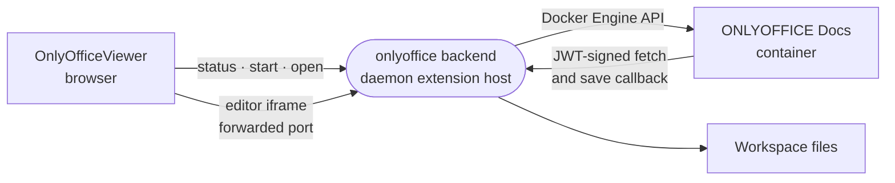

# onlyoffice

Opens Word, spreadsheet and presentation files from the workspace in a full ONLYOFFICE Docs editor that runs as a container inside the sandbox.



- Contributes one `office` viewer for the formats in `src/formats.ts`. It is `edit` and `path`-fed, so it wins over
  the render-only viewers in [../viewers](../viewers) for the same extensions and reads the file through its own
  backend.
- Two halves. The web half (`src/index.ts`) is compiled into the editor app as a builtin. The backend
  (`src/server/server.ts`, bundled to `dist/server.js`) runs in the daemon's extension host with only Node builtins
  available, so everything else is bundled in.
- The editor needs the sandbox's Docker engine. Without it the viewer shows `docker-off`. The first start pulls a
  multi-gigabyte image and takes minutes; the `autoStart` setting brings the container up at boot, and an idle
  container is stopped.
- The backend's listener sits outside the daemon's bearer auth on a forwarded port. The editor page takes a session
  token, and the container signs every fetch and save with a per-workspace JWT secret kept under the state dir.
- A file from a conversation's checkout opens view-only. Saves go to the shared tree atomically: written beside the
  file, then moved over it.

## Key files

- [src/extension.ts](src/extension.ts) — registers the `office` viewer.
- [src/OnlyOfficeViewer.vue](src/OnlyOfficeViewer.vue) — the start card, the wait and the framed editor.
- [src/server/server.ts](src/server/server.ts) — `activateServer`: the `/status`, `/start` and `/open` routes, reads and saves.
- [src/server/document-server.ts](src/server/document-server.ts) — the container's lifecycle: pinned image, health, idle stop.
- [src/server/listener.ts](src/server/listener.ts) — the editor page, document fetch, save callback and proxy to the server's UI.
- [src/contract.ts](src/contract.ts) — `DocsState`, the states both halves agree on.

## Commands

```sh
pnpm --filter @intentic/ext-onlyoffice build   # dist/server.js
pnpm --filter @intentic/ext-onlyoffice test
```
