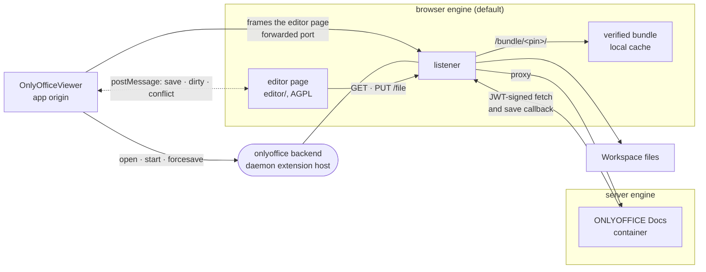

# onlyoffice

Opens Word, spreadsheet and presentation files from the workspace in an ONLYOFFICE editor, running either in the owner's browser from a bundle the sandbox downloads once, or as a document server container in the sandbox's Docker engine.


```mermaid
flowchart LR
    viewer["OnlyOfficeViewer<br/>app origin"] -->|"open · start · forcesave"| ext(["onlyoffice backend<br/>daemon extension host"])
    viewer -->|"frames the editor page<br/>forwarded port"| listener["listener"]
    ext --- listener
    subgraph browser["browser engine (default)"]
        page["editor page<br/>editor/, AGPL"] -->|"GET · PUT /file"| listener
        listener -->|"/bundle/&lt;pin&gt;/"| bundle["verified bundle<br/>local cache"]
    end
    subgraph server["server engine"]
        listener -->|"proxy"| docs["ONLYOFFICE Docs<br/>container"]
        docs -->|"JWT-signed fetch<br/>and save callback"| listener
    end
    viewer <-.->|"postMessage: save · dirty · conflict"| page
    listener --> files["Workspace files"]
```

- Contributes one `office` viewer for the formats in `src/formats.ts`. It is `edit` and `path`-fed, so it wins over
  the render-only viewers in [../viewers](../viewers) for the same extensions and reads the file through its own
  backend.
- Two engines, chosen by the `engine` setting. **browser**, the default, needs no Docker: ONLYOFFICE's offline build
  converts with x2t compiled to WebAssembly and edits in the owner's browser. **server** runs ONLYOFFICE Docs as a
  container, and is the one where two tabs co-edit a file live.
- Three halves. The web half (`src/index.ts`) is compiled into the editor app as a builtin. The backend
  (`src/server/server.ts`, bundled to `dist/server.js`) runs in the daemon's extension host with only Node builtins
  available, so everything else is bundled in. The browser engine's editor page ([editor/](editor), built to
  `dist/editor/editor.js`) is served by the backend's listener and framed by the viewer.
- The listener sits outside the daemon's bearer auth on a forwarded port and takes the same port again after a
  restart. Its editor page and its `/file` route take a session token; the bundle's files are public and served under
  their pin, compressed.

## The browser engine

- The bundle is pinned by content in `src/server/bundle-pin.ts`: ONLYOFFICE's sdkjs and web-apps in their offline
  build, the x2t converter, and a font catalog that may be handed on. The first open downloads it (about 200 MB, once)
  into the workspace's rebuildable cache, `.intentic/local/cache/onlyoffice/bundle/<pin>/`, which the watcher
  ignores. Every file is hashed on the way in, and the tree is served only once all of it matched the pin; a stalled,
  interrupted or altered download leaves nothing behind, and the next open tries again. `autoStart` downloads it at
  boot instead.
- The page opens the document from `/file` and saves by asking the editor for its document in its own format and
  writing it back with `PUT /file`, naming the version it last saw. It saves on Ctrl+S, when the viewer leaves the
  document, when the browser tab is hidden, and once the reader has paused with unsaved edits.
- A file that changed on disk since (an agent's edit, another tab) is never written over silently: the write answers
  409 and the viewer asks. Keep mine writes the edits over the change; Keep both writes them beside the file as a
  copy and shows the file as it is on disk; Discard mine drops them and loads the file as it is on disk.
- The legacy binary formats (doc, xls, ppt) open view-only, since x2t cannot write them; so does a conversation's
  checkout, as in the server engine. File > Download as reaches the browser as a download, never the workspace.
- Leaving a document keeps its editor alive where the browser has `Element.moveBefore`, as the server engine does, and
  the kept page saves what it holds first. A browser without it lets the frame go at once, so edits typed since the
  last save are lost when a document is left within seconds of typing.
- The page and the ported runtime corrections are AGPL-3.0, like the bundle: [editor/NOTICE](editor/NOTICE) has the
  licences, the source of both, and what was modified. The MIT code here reaches the page only through postMessage and
  HTTP.

## The server engine

- It needs the sandbox's Docker engine; without it the viewer shows `docker-off`. The first start pulls a
  multi-gigabyte image and takes minutes; `autoStart` brings the container up at boot, and an idle container is
  stopped. An editor with its socket open counts as use, however long nobody types.
- The image regenerates fonts, theme previews, script caches, plugins and a gzip of every static file on each start.
  The container runs it with each step skipped once done, so only its first start takes minutes and every later one
  takes seconds. Each container also gets its own cache tag, so the static files keep their URLs across restarts and
  the browser's cache of them survives.
- A document key stands for one file content, so two tabs on one file co-edit. The server holds a key as outdated once
  it has made the final save of its session: an open under it would get "Version changed", or the conversion cached
  before the edits. So a key is retired then and never handed out again, and an editor told its key is outdated asks
  the listener for a fresh one (`/refresh`) instead of reloading the page.
- Leaving a document keeps its editor alive (up to three, ten minutes each) where the browser has `Element.moveBefore`,
  and asks the server to write what was typed now. Coming back shows that editor at once, inert until the backend
  confirms it still holds the file on the same server run; one it does not confirm is replaced by a new one.
- The container signs every fetch and save with a per-workspace JWT secret kept under the state dir. A file from a
  conversation's checkout opens view-only, keyed by the digest of its bytes. Saves go to the shared tree atomically:
  written beside the file, then moved over it. A final save that changed nothing since the last forced one writes
  nothing, so it cannot overwrite a change made to the file in between.

- **On the user's own computer**, the desktop app's local windows edit documents with the same browser engine, with
  no daemon: `@intentic/ext-onlyoffice/local-office` (`src/server/local-office.ts`) answers the viewer's four routes
  for one folder per window inside the app's `intentic-files` sidecar ([local-files](../../_devices/local-files)).
  Its listener keeps to loopback (`host` in `listener.ts`), where a sandbox's listens on every interface for the
  document server's container, and the bundle is downloaded once into the app's cache.

## Key files

- [src/OnlyOfficeViewer.vue](src/OnlyOfficeViewer.vue) — the card, the wait, the conflict and failure notices, and the slot the editor goes in.
- [src/slot.ts](src/slot.ts) — the editor frame: kept on leaving, trusted again only once the backend vouches for it, and spoken to by message.
- [src/server/server.ts](src/server/server.ts) — `activateServer`: the `/status`, `/start`, `/open` and `/forcesave` routes for both engines.
- [src/server/browser-engine.ts](src/server/browser-engine.ts) — the browser engine's sessions, the page it frames, and the file reads and guarded writes.
- [src/server/bundle.ts](src/server/bundle.ts) — the one download: streamed, hashed file by file, and served only once it matches the pin.
- [editor/src/save.ts](editor/src/save.ts) — when the page exports and writes the document, and the conflict it holds for the owner.

## Commands

```sh
pnpm --filter @intentic/ext-onlyoffice build   # dist/server.js and dist/editor/editor.js
pnpm --filter @intentic/ext-onlyoffice test
# The browser engine end to end without a sandbox: the real download, listener and page, and a stand-in viewer.
bun scripts/browser-engine-harness.ts --workspace /tmp/oo-work
```
