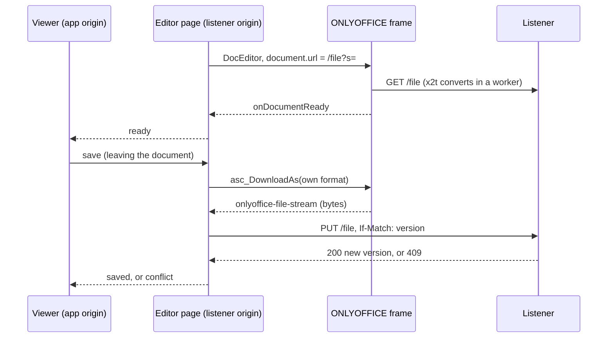

# editor

The browser engine's editor page: ONLYOFFICE's offline build running in the owner's browser, reading and writing one workspace file through the extension's listener. It is AGPL-3.0 (see [LICENSE](LICENSE) and [NOTICE](NOTICE)); the rest of the extension is MIT and talks to it only over postMessage and HTTP.

- The backend serves the page at `/editor?s=<token>` with its config as JSON (`EditorPageConfig` in
  [../src/protocol.ts](../src/protocol.ts)), the bundle's `api.js` from `/bundle/<pin>/`, and this build from
  `/page/<hash>/editor.js`.
- Saves happen on Ctrl+S or the Save button, when the viewer leaves the document or the browser tab is hidden, and
  once the reader has paused for 10 s with unsaved edits (at most every 30 s). An export blocks the editor while x2t
  runs, so an automatic save never lands between two keystrokes.
- A save sends the version the page last saw. A file that changed on disk meanwhile (an agent's edit, another tab)
  answers 409, nothing is written, and the viewer asks the owner: keep mine, keep both (mine goes beside it as a copy),
  or take theirs.
- Bytes the editor exports while no save waits for them are the reader's own export (File > Download as), and go to
  the browser as a download.
- [src/guards/](src/guards) holds runtime corrections to the offline build, ported from ranuts/document: each one a
  defect that stopped documents opening or saving without a document server. They re-apply while the editor boots.

## Key files

- [src/main.ts](src/main.ts) — builds the editor, applies the corrections, wires saves to the listener and messages to the viewer.
- [src/save.ts](src/save.ts) — the save controller: when to export, what to write, a conflict held until the owner answers.
- [src/guards/index.ts](src/guards/index.ts) — every runtime correction, and which ones a document needs before it opens.
- [NOTICE](NOTICE) — the licences involved, where the source of the page and the bundle is, and what was modified.

## Updating the bundle

The pin is [../src/server/bundle-pin.ts](../src/server/bundle-pin.ts). A new pin needs a new `id`, the archive `url`,
and the `files` and `digest` of the kept tree, which `treeDigest` in [../src/server/bundle.ts](../src/server/bundle.ts)
computes. Each patch must still find its text exactly once, or the install fails rather than serve an unpatched file.
The corrections in src/guards/ reach into minified vendor internals, so check a new pin by opening, editing and saving
a document of each type (and one with an image) before shipping it.
