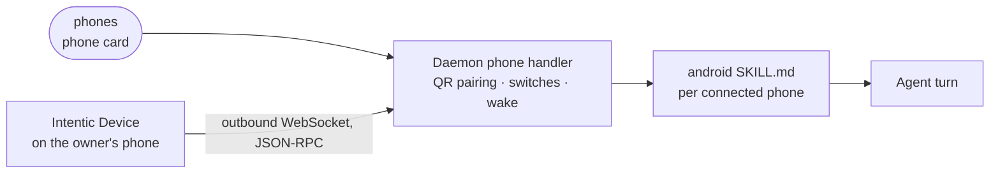

# phones

A data-only extension that adds the "Android phone" connection card, which lets the agent work on the owner's own phone through the Intentic Device app.

- For what only the phone has: an app with no web version, a code that arrives as a notification, a photo or a file on
  it. The agent acts on the phone's screen in the apps the owner allows, and the phone shows when it is connected.
- Holds no code. The manifest declares one `phone`-kind card with its download link and setup steps; the daemon's
  generic peer handler pairs the phone through a QR code and writes the skill.
- The far end is the app in [_devices/android](../../_devices/android), which connects out to the sandbox, enforces the
  card's switches and its own per-app allow-list, and can be paused from the phone's Quick Settings.
- [skills/android/SKILL.md](skills/android/SKILL.md) is templated per connected phone; the tool table and the rules
  every phone shares come from the daemon (`PHONE_TOOLS_NOTE`).

## Key files

- [intentic-extension.json](intentic-extension.json) — the card, its download link and guide.
- [skills/android/SKILL.md](skills/android/SKILL.md) — what is particular to Android, under the shared tool note.
- [../../_sandbox/sandbox/src/capabilities/handlers/phone.handler.ts](../../_sandbox/sandbox/src/capabilities/handlers/phone.handler.ts) — pairing, switches and connection status for a `phone` card.
