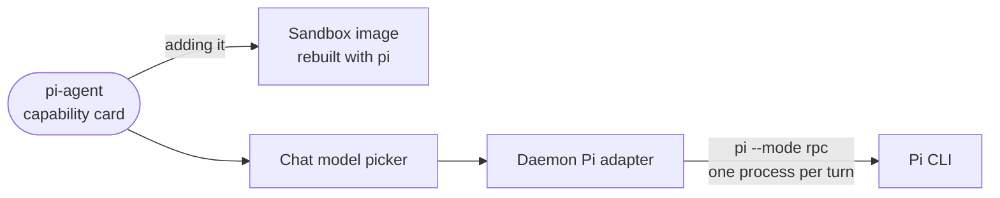

# pi-agent

A data-only extension that adds the Pi coding agent as a chat provider: a capability card, and a Dockerfile fragment that installs the `pi` CLI.

- Holds no code. The manifest declares the `pi` capability (`kind: agent`) and an `environment` fragment. The
  directory is copied into the sandbox image whole.
- Adding the card bakes the CLI into the image, a one-time rebuild. After that the card's `command`, `env` and
  login fields configure how the daemon spawns it.
- The daemon drives Pi over Pi's own RPC protocol, which carries mid-turn steering and an effort level. Pi has no
  MCP seam, so it gets none of the sandbox's tools.
- Sign-in and the default model live inside Pi itself (`/login`, `/model` in a terminal), or API keys go in the
  card's environment field.

## Key files

- [intentic-extension.json](intentic-extension.json) — the capability card, its guide and its fields.
- [env/pi.Dockerfile](env/pi.Dockerfile) — the image fragment that installs the Pi CLI.
- [../../_sandbox/sandbox/src/runtimes/pi/pi-agent.ts](../../_sandbox/sandbox/src/runtimes/pi/pi-agent.ts) — the daemon side that runs a turn over Pi's RPC.
