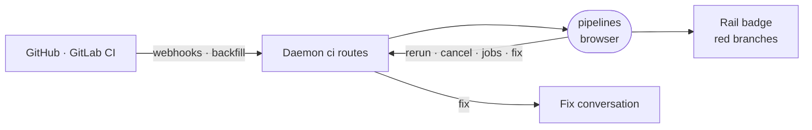

# pipelines

The Pipelines rail view: CI runs from the workspace repositories' GitHub and GitLab remotes on one board, with rerun, cancel and a fix-with-agent action.



- Runs in the browser, compiled into the editor app as a builtin. It holds no CI state: runs and jobs come from the
  daemon's `ci` procedures, which keep them fresh from vendor webhooks and backfill when stale.
- The tile appears only when a GitHub or GitLab `cli` capability is connected. The board shows the open project's
  repositories, ranks them by how loudly they ask (`src/repoStandings.ts`) and draws each run's jobs as a layered
  graph (`src/pipelineDag.ts`).
- The badge counts branches whose last commit is red. It clears when a later commit passes, never on viewing.
  `startCiAttention` polls from activation, so the badge is live while the board is closed.
- "Fix with agent" asks the daemon to start a fix conversation. Its id is derived from the run, so the board pairs
  runs with their fixes without a store of its own (`src/ciFixes.ts`).

## Key files

- [src/extension.ts](src/extension.ts) — registers the rail view: when it shows, its badge and its warm-up query.
- [src/PipelinesView.vue](src/PipelinesView.vue) — the board: repository picker, run rows, job graphs.
- [src/usePipelines.ts](src/usePipelines.ts) — the runs query and the rerun, cancel and fix mutations.
- [src/ciStreaks.ts](src/ciStreaks.ts) — when a branch counts as red, the rule behind the badge.
- [src/pipelineDag.ts](src/pipelineDag.ts) — a run's flat job list turned into layers.

## Commands

```sh
pnpm --filter @intentic/ext-pipelines test
```
