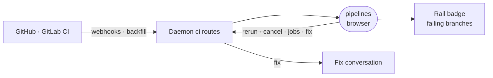

# pipelines

The Pipelines rail view: CI runs from the workspace repositories' GitHub and GitLab remotes on one board, a failing main line with the one fix agent on it, and rerun, cancel and fix actions.


```mermaid
flowchart LR
    vendor["GitHub · GitLab CI"] -->|"webhooks · backfill"| daemon["Daemon ci routes"]
    daemon --> ext(["pipelines<br/>browser"])
    ext -->|"rerun · cancel · jobs · fix"| daemon
    daemon -->|"fix"| agent["Fix conversation"]
    ext --> badge["Rail badge<br/>failing branches"]
```

- Runs in the browser, compiled into the editor app as a builtin. It holds no CI state: runs, jobs and main's failures come
  from the daemon's `ci` procedures, which keep them fresh from vendor webhooks and backfill when stale.
- The tile appears only when a GitHub or GitLab `cli` capability is connected. The board shows the open project's
  repositories, ranks them by how loudly they ask (`src/repoStandings.ts`) and draws each run's jobs as a layered graph
  (`src/graph/pipelineDag.ts`). A GitHub run is drawn the way GitHub's own run page draws it: the same columns, cards and
  order, with every job the workflow declares, including the ones the run has not reported yet or never ran.
- A failing main-line branch is one incident block at the head of its repository's runs
  (`src/fixes/MainFailureBanner.vue`). Its header says the branch, since when and which jobs, who has it (a pill that
  opens the agent) and the one press, then one sentence on where the fix stands and the reader's move, read off the
  agent's live stance (`storyOf`): working, waiting on you, ready to review, landed ("commit and push it: the next run on
  main shows whether it worked"), being measured by a run that started after it landed, or handed back with a two-word
  reason from the contract's `MainFailureHandBack`. Under the header sit the runs it is about (`coveredRuns`: the
  branch's failures nothing has passed since, and its runs still going), indented and joined to the header's glyph by a
  drawn lane, a trunk with an elbow into each run's status glyph, measured from where they sit so it survives a row
  opening into its job graph. Every other run follows in time order. It never shows the daemon's sentence or a turn's
  error: those are in the agent's conversation. The agent is joined by the id the failure names (`fixer`), never by a
  later run's derived id (`src/fixes/mainFailures.ts`).
- One fix control per breakage. On a failing main line it is the block's: the runs inside show the run, Re-run and
  Cancel, and no Fix, Continue, Start over or agent pointer (`leadsRows`), since every press on main goes to the same
  agent anyway; nor does a landed fix promote Re-run there, since the fix is uncommitted and re-running the old commit
  cannot measure it. The block's press is the rows' own split button, so its caret still re-points the model and, over
  an agent that already tried, ends in Continue or Start over. Any other branch keeps "Fix with agent" on its failed
  run rows.
- The badge counts branches whose last commit failed, in the rail's danger tone. It never clears on viewing: a failing
  branch clears when a later commit passes. `startCiAttention` polls from activation, so the badge is live while the board is closed.
- "Fix with agent" asks the daemon to start a fix conversation. Its id is derived from the run, so the board pairs
  runs with their fixes without a store of its own (`src/fixes/ciFixes.ts`). A plain press sends the model the button
  names (the job's pin in Models, else the model a new chat would open on) as `fallback`: the daemon holds no chat pick
  of its own, so it runs that one when no pinned model can, while it can serve its provider (`src/usePipelines.ts`).

## Key files

- [src/extension.ts](src/extension.ts) — registers the rail view: when it shows, its badge and its warm-up query.
- [src/PipelinesView.vue](src/PipelinesView.vue) — the board: repository picker, failing main lines, run rows.
- [src/ciStreaks.ts](src/ciStreaks.ts) — when a branch counts as failing, the rule behind the badge.
- [src/fixes/mainFailures.ts](src/fixes/mainFailures.ts) — a failing main line and its one fix agent, joined by the fixer's own id.
- [src/graph/pipelineDag.ts](src/graph/pipelineDag.ts) — a run's flat job list turned into layers, cards and GitHub's order.

## Commands

```sh
pnpm --filter @intentic/ext-pipelines test
```
