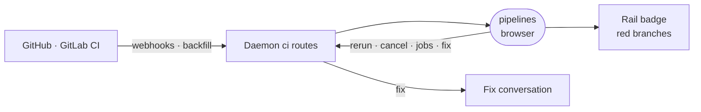

# pipelines

The Pipelines rail view: CI runs from the workspace repositories' GitHub and GitLab remotes on one board, main's red with the one fix agent on it, and rerun, cancel and fix actions.


```mermaid
flowchart LR
    vendor["GitHub · GitLab CI"] -->|"webhooks · backfill"| daemon["Daemon ci routes"]
    daemon --> ext(["pipelines<br/>browser"])
    ext -->|"rerun · cancel · jobs · fix"| daemon
    daemon -->|"fix"| agent["Fix conversation"]
    ext --> badge["Rail badge<br/>red branches"]
```

- Runs in the browser, compiled into the editor app as a builtin. It holds no CI state: runs, jobs and main's reds come
  from the daemon's `ci` procedures, which keep them fresh from vendor webhooks and backfill when stale.
- The tile appears only when a GitHub or GitLab `cli` capability is connected. The board shows the open project's
  repositories, ranks them by how loudly they ask (`src/repoStandings.ts`) and draws each run's jobs as a layered graph
  (`src/graph/pipelineDag.ts`).
- A red main-line branch says so once at the head of its repository's runs (`src/fixes/MainRedCallout.vue`): since when, the
  jobs failing now, and the one fix agent the daemon put on it at the first failed job, which every later failure on the
  branch goes to until a run passes. The agent is joined by the id the red names (`fixer`), never by a later run's
  derived id, and the red turns to "Waits for you" once the daemon hands it back: its turns spent, it finished without
  changing anything, or repairs are off (`src/fixes/mainReds.ts`).
- The badge counts branches whose last commit is red, in the rail's danger tone. It never clears on viewing: a red clears
  when a later commit passes. `startCiAttention` polls from activation, so the badge is live while the board is closed.
- "Fix with agent" asks the daemon to start a fix conversation. Its id is derived from the run, so the board pairs
  runs with their fixes without a store of its own (`src/fixes/ciFixes.ts`).

## Key files

- [src/extension.ts](src/extension.ts) — registers the rail view: when it shows, its badge and its warm-up query.
- [src/PipelinesView.vue](src/PipelinesView.vue) — the board: repository picker, main's reds, run rows.
- [src/ciStreaks.ts](src/ciStreaks.ts) — when a branch counts as red, the rule behind the badge.
- [src/fixes/mainReds.ts](src/fixes/mainReds.ts) — main's red and its one fix agent, joined by the fixer's own id.
- [src/graph/pipelineDag.ts](src/graph/pipelineDag.ts) — a run's flat job list turned into layers.

## Commands

```sh
pnpm --filter @intentic/ext-pipelines test
```
