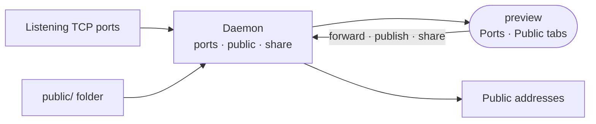

# preview

Adds the Ports and Public tabs to the Sandbox hub, showing what the sandbox exposes to the internet and letting the owner forward, publish or share it.

- Runs in the browser, compiled into the editor app as a builtin. Both views use the `sandbox` surface, since
  their subject is the box itself.
- Ports lists every listening TCP port, attributed by the daemon and grouped into the owner's work and sandbox
  internals. Forwarding exposes a port at its `port-<slot>` hostname. The list refreshes on the daemon's `ports`
  push.
- Public lists the workspace outbox, `public/`, which is served with no auth in front. Files the daemon refuses to
  serve are listed with the reason. The manifest's `files` binding refreshes the tab when anything writes there,
  an agent included.
- The same tab lists conversations shared as pages: Update re-takes the snapshot behind an existing link, and
  removing a share takes the page down.
- The dev-server Preview area is core editor code in
  [../../_editor/web/src/features/preview](../../_editor/web/src/features/preview); this extension only adds the
  two hub tabs.

## Key files

- [src/extension.ts](src/extension.ts) — registers the two Sandbox hub tabs.
- [src/PortsView.vue](src/PortsView.vue) — the port list and the forward action.
- [src/PublicView.vue](src/PublicView.vue) — the outbox, refused files and shared conversations.
- [src/usePorts.ts](src/usePorts.ts) — ports and forwarding through the daemon's `ports` procedures.
- [src/usePublic.ts](src/usePublic.ts) — the outbox through the daemon's `public` procedures.
- [src/useShares.ts](src/useShares.ts) — shared conversation pages through the `share` procedures.
