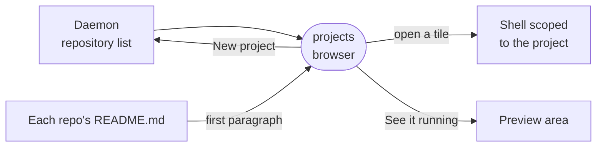

# projects

The Projects rail view: the workspace's repositories as a dashboard of tiles, one press to open a project or start a new one.



- Runs in the browser, compiled into the editor app as a builtin. It registers one `rail` view that shows even
  with no repositories, since the New project tile is where an empty workspace starts.
- A tile's description is the first paragraph of that repository's `README.md`, reduced to one plain line by
  `summaryOf`. A README that opens with a heading and nothing else gives an empty tile.
- Opening a tile makes the project the shell's scope, and every other area narrows to it. While a project is open
  the rail tile wears its two-letter monogram and a badge that names it.
- New project fills in the first free name in a series and creates the folder through the daemon, which has the
  last word on valid names.
- The list is never polled: the host's repository push re-reads it when a clone, scaffold or delete lands.

## Key files

- [src/extension.ts](src/extension.ts) — registers the rail view, its monogram and its scope badge.
- [src/ProjectsView.vue](src/ProjectsView.vue) — the tile grid and the New project field.
- [src/useProjects.ts](src/useProjects.ts) — the repository list plus one README read per tile.
- [src/projects.ts](src/projects.ts) — pure helpers: `summaryOf`, `freeProjectName`, `slugOf`, `monogramOf`.
- [src/projects.test.ts](src/projects.test.ts) — which README paragraph becomes the summary, by example.

## Commands

```sh
pnpm --filter @intentic/ext-projects test
```
