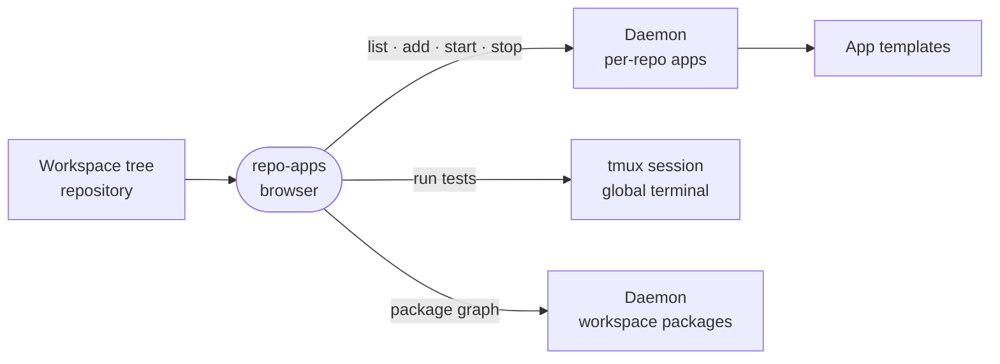

# repo-apps

Adds the Apps and Dependencies panels to a repository in the Workspace tree: a monorepo's apps with start, stop and tests, and its package dependency graph.



- Runs in the browser, compiled into the editor app as a builtin. Both views use the `directory` surface, so they
  open from a repository in the Workspace tree.
- Apps is the full panel for a monorepo and a flat Tests list for any other repository with tests. A monorepo with a
  deploy config or the `intent` role counts as a plain repository and gets no Dependencies panel.
- An app is a process the daemon manages: the panel lists it with its preview URL and status, and starts or stops
  it. Adding apps scaffolds from the daemon's templates in a one-shot terminal session.
- Every test run is its own tmux session in the one global terminal, so a second run never collides with one still
  going. Test projects are found from the shared workspace tree (`src/useTests.ts`), with no extra fetch.
- Dependencies draws the monorepo's workspace packages as a graph. Dev dependencies sit behind a toggle, and
  selecting a package highlights what it uses and what uses it.

## Key files

- [src/extension.ts](src/extension.ts) — which repositories get which panel.
- [src/AppsView.vue](src/AppsView.vue) — apps, packages and library tests for one repository.
- [src/useApps.ts](src/useApps.ts) — the daemon's per-repo app procedures: list, add, start, stop.
- [src/useTests.ts](src/useTests.ts) — test projects from the workspace tree, and the run that opens a terminal.
- [src/DependenciesView.vue](src/DependenciesView.vue) — the package dependency graph.

## Commands

```sh
pnpm --filter @intentic/ext-repo-apps test
```
