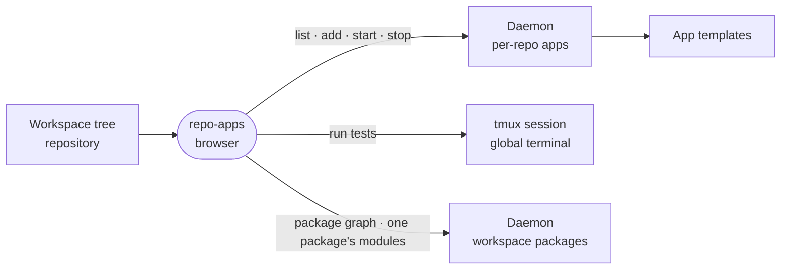

# repo-apps

Adds the Apps and Dependencies panels to a repository in the Workspace tree: a monorepo's apps with start, stop and tests, and its package dependency graph.


```mermaid
flowchart LR
    tree["Workspace tree<br/>repository"] --> ext(["repo-apps<br/>browser"])
    ext -->|"list · add · start · stop"| apps["Daemon<br/>per-repo apps"]
    ext -->|"run tests"| tmux["tmux session<br/>global terminal"]
    ext -->|"package graph · one package's modules"| pkgs["Daemon<br/>workspace packages"]
    apps --> tpl["App templates"]
```

- Runs in the browser, compiled into the editor app as a builtin. Both views use the `directory` surface, so they
  open from a repository in the Workspace tree.
- Apps is the full panel for a monorepo and a flat Tests list for any other repository with tests. A monorepo with a
  deploy config or the `intent` role counts as a plain repository and gets no Dependencies panel.
- An app is a process the daemon manages: the panel lists it with its preview URL and status, and starts or stops
  it. Adding apps scaffolds from the daemon's templates in a one-shot terminal session.
- Every test run is its own tmux session in the one global terminal, so a second run never collides with one still
  going. Test projects are found from the shared workspace tree (`src/useTests.ts`), with no extra fetch.
- Dependencies shows a monorepo's architecture as its files state it, in three tabs. The daemon reads every declared
  workspace dependency and what the dependent's own files do with it: imports a value from it, imports only its types,
  names it in a shipped file such as a Dockerfile, uses it only in tests and tool configs, or nothing at all.
  - Overview opens on the counts, the findings and every area against every other. The findings are runtime
    dependencies nothing uses, runtime dependencies only tests use, and pairs of areas that depend on each other.
  - Graph draws the packages without the edges a longer path already implies. The few packages most others use are
    chips on each card rather than lines, and packages with no line left are listed under the graph. A toggle brings
    back each one.
  - Inside opens one package. Its directories are stacked in the layers its `layers.json` declares, or in the tiers
    its own imports imply when it has none. Imports that reach up a layer, and cycles within one, are listed with
    their files and lines.
- Areas are the components of `docs/architecture/repo.json` when the repository has one, and top-level folders
  otherwise. They are ordered so the fewest edges point up the order, which is what makes an edge that does point up
  worth reading.

## Key files

- [src/extension.ts](src/extension.ts) — which repositories get which panel.
- [src/AppsView.vue](src/AppsView.vue) — apps, packages and library tests for one repository.
- [src/useApps.ts](src/useApps.ts) — the daemon's per-repo app procedures: list, add, start, stop.
- [src/useTests.ts](src/useTests.ts) — test projects from the workspace tree, and the run that opens a terminal.
- [src/DependenciesView.vue](src/DependenciesView.vue) — the Dependencies tabs, and the grouping they share.
- [src/depModel.ts](src/depModel.ts) — what the views derive from the graph: implied edges, hubs, areas and their
  order, findings.
- [src/layerModel.ts](src/layerModel.ts) — one package's layers or tiers, its upward imports and its cycles.

## Commands

```sh
pnpm --filter @intentic/ext-repo-apps test
```
