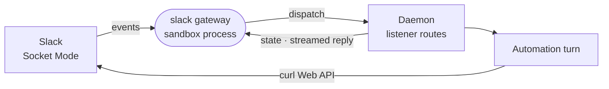

# slack

Connects a Slack workspace to the sandbox: a capability card and skill for the agent, and a Socket Mode gateway process that wakes automations on messages and reactions.



- Three pieces. The capability card takes a bot token (`xoxb-`) and an app-level token (`xapp-`). The skill
  (`skills/slack/SKILL.md`) teaches the agent to call Slack's Web API with `curl` and `$SLACK_BOT_TOKEN`. The gateway
  is a `processes` entry the daemon runs while a Slack card or Slack automation exists.
- The gateway holds one Socket Mode socket per Slack app, and only while an enabled Slack automation exists; the
  daemon holds no Slack connection. It reconciles against `/listeners/slack/state` and posts every message and
  reaction to the daemon's dispatch route, using [connector-runtime](../../_shared/connector-runtime) for the
  process shell.
- On a mention it adds `:eyes:`, then paints the agent's reply into the thread live by editing one message, and
  spills a long reply into follow-ups. Posts from its own apps never wake it.
- Socket Mode is an outbound WebSocket, so no public URL is needed. A revoked token is fatal and pauses reconnecting
  for a backoff period.
- The manifest is baked into every sandbox image, so the card always exists. The runnable gateway ships only in the
  messaging image pack.

## Key files

- [intentic-extension.json](intentic-extension.json) — the card, its setup guide, the listener events and the gateway process.
- [src/gateway.ts](src/gateway.ts) — the process: a token pair is one connection, reconciled by `runConnectorGateway`.
- [src/listener.ts](src/listener.ts) — Slack envelopes to dispatched events, and the live reply in the thread.
- [src/client.ts](src/client.ts) — the socket and Web API pool, and which Slack errors are fatal.
- [skills/slack/SKILL.md](skills/slack/SKILL.md) — what the agent learns about using Slack.

## Commands

```sh
pnpm --filter @intentic/ext-slack build   # dist/gateway.js
pnpm --filter @intentic/ext-slack test
```
