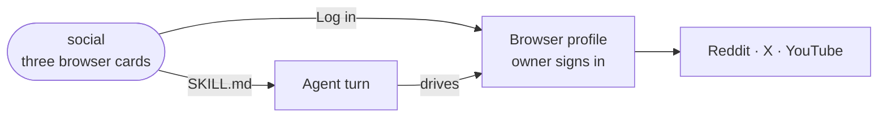

# social

A data-only extension that adds Reddit, X and YouTube as browser capabilities, so the agent can act on each site as the owner through a signed-in browser.

- Holds no code. The manifest declares three `kind: browser` capabilities, each with a login URL, a home URL and a
  skill. The directory is copied into the sandbox image whole; the browser machinery that acts on the cards is core.
- The signed-in browser profile is the credential, so the cards have no fields. One site can be connected more than
  once, and each skill is rendered with every connected account on one roster (`${accounts}`).
- YouTube signs in at Google, which refuses automated logins, so the owner signs in by hand in the live window.
- Automating an account may break the site's terms; each card's hint says so.

## Key files

- [intentic-extension.json](intentic-extension.json) — the three cards: names, hints, login and home URLs.
- [skills/reddit/SKILL.md](skills/reddit/SKILL.md) — reading, posting, commenting and voting on Reddit.
- [skills/x/SKILL.md](skills/x/SKILL.md) — posting, replying and following on X.
- [skills/youtube/SKILL.md](skills/youtube/SKILL.md) — watching, commenting and subscribing on YouTube.
