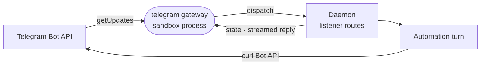

# telegram

Connects a Telegram bot to the sandbox: a capability card and skill for the agent, and a long-polling gateway process that wakes automations on messages.



- Three pieces. The capability card takes one token from `@BotFather`. The skill (`skills/telegram/SKILL.md`)
  teaches the agent to call the Bot API with `curl` and `$TELEGRAM_BOT_TOKEN`. The gateway is a `processes` entry
  the daemon runs while a Telegram card or Telegram automation exists.
- The gateway long-polls once per bot, and only while an enabled Telegram automation exists. It uses no SDK, since
  the Bot API is HTTPS and JSON, and needs no public URL. It is built on
  [connector-runtime](../../_shared/connector-runtime).
- Telegram allows one reader per bot. A webhook or a second poller answers 409, which the gateway treats as fatal;
  it never clears a webhook itself.
- Bots cannot read a chat's past. The context handed to the agent is the recent messages this process saw go by,
  and a restart empties it.
- On a private message, an @mention or a reply to the bot, it shows "typing…" and paints the reply into the chat as
  the turn streams, spilling past Telegram's length limit into follow-ups.
- In a group the bot hears only @mentions until privacy mode is turned off in BotFather.

## Key files

- [intentic-extension.json](intentic-extension.json) — the card, its setup guide, the listener event and the gateway process.
- [src/gateway.ts](src/gateway.ts) — the process: one bot token is one connection, reconciled by `runConnectorGateway`.
- [src/client.ts](src/client.ts) — the poll loop, Bot API calls and which errors are fatal.
- [src/listener.ts](src/listener.ts) — updates to dispatched messages, history rings and the live reply.
- [skills/telegram/SKILL.md](skills/telegram/SKILL.md) — what the agent learns about using Telegram.

## Commands

```sh
pnpm --filter @intentic/ext-telegram build   # dist/gateway.js
pnpm --filter @intentic/ext-telegram test
```
