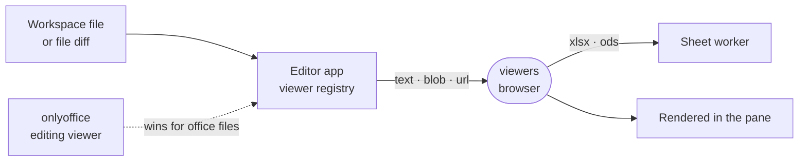

# viewers

Read-only viewers for the workspace files that are not source text: images, SVG, PDF, audio and video, Word, spreadsheets, slides, RTF and EPUB.



- Runs in the browser, compiled into the editor app as a builtin. The host picks a viewer by file extension, fetches
  the file the way the manifest says (`text`, `blob` or a streaming `url`), and the lazy-loaded component only
  renders it.
- All parsing happens client-side. Word goes through `docx-preview`; PowerPoint, OpenDocument, RTF and EPUB have
  parsers of their own under `src/pptx`, `src/odf`, `src/rtf` and `src/epub`. Spreadsheets parse in a Web Worker that
  reads the format from the bytes, so a misnamed file still opens. PDF uses the browser's own plugin.
- Word files also compare: the file diff draws both versions as one document with insertions and deletions marked
  (`src/docxRedline.ts`).
- None of these write the file. An editing viewer claiming the same extension wins, which is how
  [../onlyoffice](../onlyoffice) takes over office formats.
- The `./docx-compare` and `./testing` exports let the editor app's tests drive the Word compare in a DOM.

## Key files

- [intentic-extension.json](intentic-extension.json) — every viewer id, its file extensions and its fetch mode.
- [src/extension.ts](src/extension.ts) — registers each viewer's component.
- [src/sheetWorker.ts](src/sheetWorker.ts) — spreadsheet parsing off the main thread.
- [src/docxRedline.ts](src/docxRedline.ts) — two Word documents merged into one marked-up document.
- [src/pptx/deck.ts](src/pptx/deck.ts) — a PowerPoint file read into drawable slides.

## Commands

```sh
pnpm --filter @intentic/ext-viewers test
```
