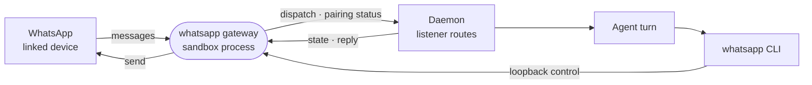

# whatsapp

Pairs the sandbox to a WhatsApp number as a linked device: a capability card, a gateway process that holds the session and wakes automations, and a `whatsapp` CLI for the agent.



- The connection is unofficial: the gateway links the way WhatsApp Web does (Baileys), against WhatsApp's terms,
  and numbers get banned. The card and the skill both ask for a dedicated number.
- WhatsApp has no API to call, so the gateway holds the only session. The agent's `whatsapp` CLI (`bin/whatsapp`,
  put on the agent's PATH by `contributes.bin`) forwards `chats`, `send`, `send-file` and `download` to the gateway's
  loopback control surface, found through a `gateway.url` file under the workspace's runtime directory.
- Unlike the other messaging gateways it connects as soon as the card exists, because pairing starts then. The card
  shows a pairing code the owner enters on the phone, refreshed while unpaired.
- Removing the card or changing its number unlinks the device and wipes the saved session.
- Chats are end-to-end encrypted with no history to fetch. The agent's context is the recent messages this process
  saw, and a restart empties it. A reply is sent whole when the turn ends.
- Built on [connector-runtime](../../_shared/connector-runtime); the runnable gateway ships in the messaging image pack.

## Key files

- [intentic-extension.json](intentic-extension.json) — the card, pairing guide, listener event, gateway process and `bin`.
- [src/gateway.ts](src/gateway.ts) — the process: one session per card, pairing status, the CLI's control routes.
- [src/client.ts](src/client.ts) — the only file that imports Baileys: pairing, reconnects, media download.
- [src/listener.ts](src/listener.ts) — incoming messages to dispatched events, history rings, typing indicator.
- [bin/whatsapp](bin/whatsapp) — the agent's CLI, a dependency-free forwarder to the gateway.

## Commands

```sh
pnpm --filter @intentic/ext-whatsapp build   # dist/gateway.js
pnpm --filter @intentic/ext-whatsapp test
```
