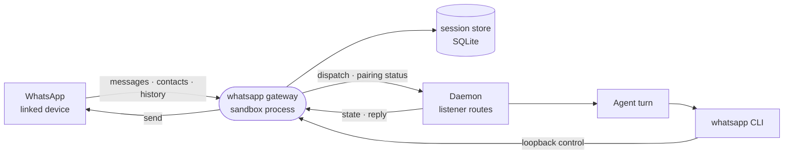

# whatsapp

Pairs the sandbox to a WhatsApp number as a linked device: a capability card, a gateway process that holds the session and wakes automations, and a `whatsapp` CLI for the agent.


```mermaid
flowchart LR
    wa["WhatsApp<br/>linked device"] -->|"messages · contacts · history"| gw(["whatsapp gateway<br/>sandbox process"])
    gw --> store[("session store<br/>SQLite")]
    gw -->|"dispatch · pairing status"| daemon["Daemon<br/>listener routes"]
    daemon -->|"state · reply"| gw
    daemon --> turn["Agent turn"]
    turn --> cli["whatsapp CLI"]
    cli -->|"loopback control"| gw
    gw -->|"send"| wa
```

- The connection is unofficial: the gateway links the way WhatsApp Web does (Baileys), against WhatsApp's terms,
  and numbers get banned. The card and the skill both ask for a dedicated number.
- WhatsApp has no API to call, so the gateway holds the only session. The agent's `whatsapp` CLI (`bin/whatsapp`,
  put on the agent's PATH by `contributes.bin`) forwards to the gateway's loopback control surface, found through a
  `gateway.url` file under the workspace's runtime directory. A chat can be named by JID, phone number or contact
  name; an ambiguous name is refused with the candidates rather than guessed.
- Unlike the other messaging gateways it connects as soon as the card exists, because pairing starts then. The card
  shows a pairing code the owner enters on the phone, refreshed while unpaired.
- The device presents itself as Chrome on Ubuntu, using the current WhatsApp Web version. WhatsApp refuses a link-code
  request that names a made-up OS, and will not finish linking a client that reports a stale version. Baileys returns
  the code before WhatsApp has answered, so the client waits for that answer before the card shows the code, and shows
  WhatsApp's refusal in its place when the request is refused.
- WhatsApp hands a linked device the address book, chat list and recent messages once, right after pairing, then only
  changes. The gateway keeps all of it in a SQLite store inside the session directory, so it survives restarts and
  goes when the device is unlinked. A session that synced before the store existed gets its address book back from a
  one-time snapshot of the contacts collection. Older messages are asked of the phone on demand, counting back from
  the oldest one stored, so the phone must be online for that.
- People have two addresses: a phone JID and a privacy id (`@lid`), and WhatsApp increasingly delivers the second.
  The store maps one to the other, so an event's `author.id` is the phone number automations' sender rules are
  written in, and a send to a bare number goes to the chat WhatsApp actually keeps for that person.
- Sends go out one at a time with a timeout, because concurrent sends on one socket have misrouted messages between
  chats elsewhere. Markdown is rewritten into WhatsApp's own marks on the way out. A reply to a mention is sent whole
  when the turn ends.
- Removing the card or changing its number unlinks the device and wipes the session, store included.
- Built on [connector-runtime](../../_shared/connector-runtime); the runnable gateway ships in the messaging image pack.

## Key files

- [intentic-extension.json](intentic-extension.json) — the card, pairing guide, listener event, gateway process and `bin`.
- [src/client.ts](src/client.ts) — the only file that imports Baileys: pairing, reconnects, sending, contact recovery.
- [src/store.ts](src/store.ts) — the session store: contacts, the `@lid` map, chats, the bounded message log, name search.
- [src/listener.ts](src/listener.ts) — incoming messages to dispatched events, sender identity, typing indicator.
- [src/routes.ts](src/routes.ts) — the CLI's control routes and the text each one answers with.
- [bin/whatsapp](bin/whatsapp) — the agent's CLI, a dependency-free forwarder to the gateway.

## Commands

```sh
pnpm --filter @intentic/ext-whatsapp build   # dist/gateway.js
pnpm --filter @intentic/ext-whatsapp test
```
