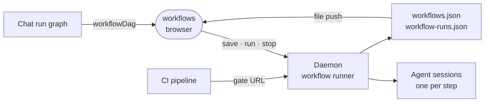

# workflows

The Workflows rail view, where the owner designs graphs of agent sessions that each produce a declared output, runs them and watches the runs.



- Runs in the browser, compiled into the editor app as a builtin. The daemon runs the steps and keeps designs in
  `.intentic/config/workflows.json` and runs in `.intentic/records/workflow-runs.json`. Both files ride the
  daemon's file-change push, so nothing here polls for them.
- A step names the steps it `needs`, and may carry a goal, a prompt, a declared output and a persona. Edits go
  through pure functions in `src/workflowEdit.ts`, which keep `needs` pointing at real steps and the graph acyclic.
- The designer and the run view draw from one derivation, `workflowDag`. The package exports it with
  `WorkflowNodeCard`, so the chat panel draws a workflow run with the same picture.
- A release gate lets a CI pipeline run a workflow and wait for one step's verdict. `src/gateSnippets.ts` writes
  the wiring for the `intentic/gate-action` step, which reads the gate URL from a secret because the URL carries its
  token.
- Nothing fires on its own: a design runs when started from this page, the chat composer or a gate. Templates
  prefill the designer and create nothing until Save. The page also keeps saved loop designs.
- The rail badge shows runs in flight, and the tile is seated only while one runs.

## Key files

- [src/extension.ts](src/extension.ts) — registers the rail view and starts the in-flight badge.
- [src/WorkflowsView.vue](src/WorkflowsView.vue) — the page: saved workflows, loops and recent runs.
- [src/WorkflowDesigner.vue](src/WorkflowDesigner.vue) — the graph editor, step inspector and gate panel.
- [src/workflowDag.ts](src/workflowDag.ts) — a workflow, with or without a run, as a layered graph.
- [src/workflowEdit.ts](src/workflowEdit.ts) — the edit operations and the invariants they hold.
- [src/gateSnippets.ts](src/gateSnippets.ts) — the CI wiring text for a release gate.

## Commands

```sh
pnpm --filter @intentic/ext-workflows test
```
