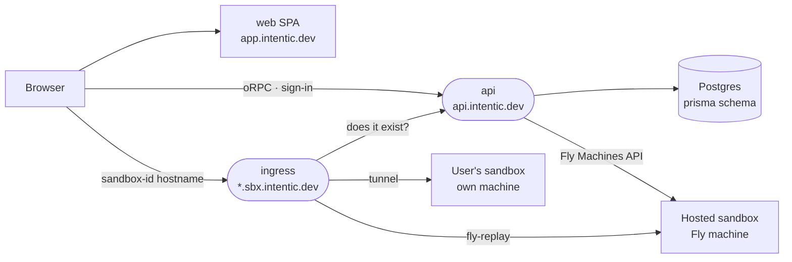

# The platform

The hosted plane behind app.intentic.dev: sign-in, the registry of every user's sandboxes, the edge that makes them reachable, hosted machines and billing.

| Package | Role |
| --- | --- |
| [api](api) | Hono + oRPC server: accounts, sandbox registry, hosted machines, billing. |
| [ingress](ingress) | Edge routing sandbox hostnames to tunnels or Fly replays. |
| [prisma](prisma) | Postgres schema, migrations and the generated client. |

The SPA served at app.intentic.dev is [`_editor/web`](../_editor/web), and the contract between it and the api is [`@intentic/api-contract`](../_shared/api-contract).
