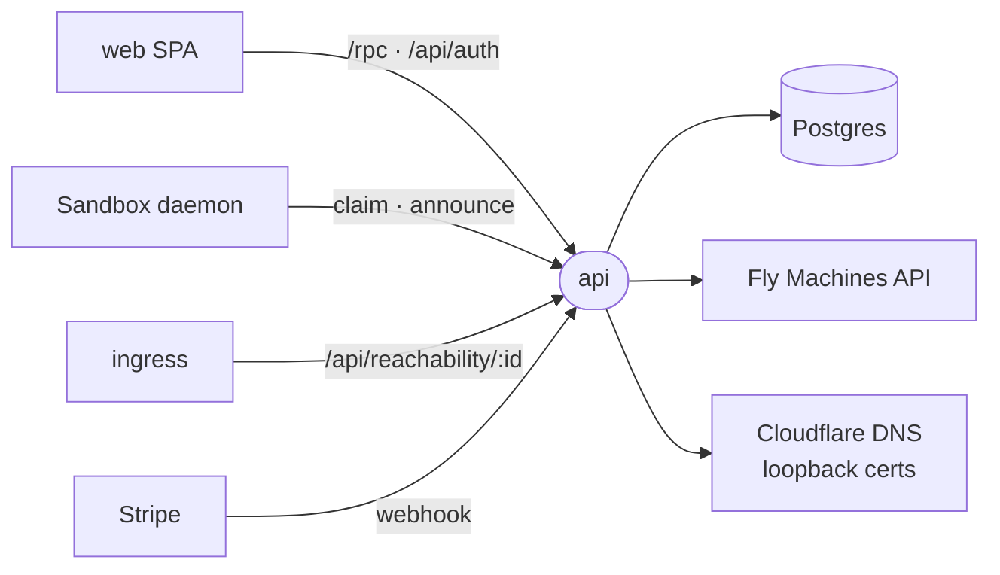

# api

The platform's HTTP server (`@intentic/api`): sign-in, the registry of sandboxes and their addresses, hosted Fly machines, the hosted plan and the agent wallet.



- A registry, never a relay: a daemon announces the address it answers on, and the browser talks to it directly.
  The api stores who owns which sandbox and where it answers; traffic between browser and sandbox never passes
  through it.
- Reachability is a signed grant. The api holds the Ed25519 private key (`INGRESS_SIGNING_KEY`), the edge holds only
  the public half, and deleting the sandbox row revokes it (`src/sandbox/reachability.ts`).
- The hosted lane is one Fly app, machine and volume per sandbox, named `<HOSTED_APP_PREFIX>-<id>`. The background
  jobs started in `src/main.ts` (warm pool, meter, abuse watch, builds, health) take a Postgres advisory lock per run
  (`src/jobs-lock.ts`), so two replicas never double-bill or double-provision.
- A hosted image change goes through the state gate (`src/sandbox/hosted/gate/state-gate.ts`), the hosted half of
  the stored-state promise in [COMPATIBILITY.md](../../COMPATIBILITY.md#stored-data). A restart, a rebuild, or a wake
  that heals a stale tunnel first runs the target image's planner (`state-plan.js`) over the machine's own volume. It
  runs in a probe: the same machine with its daemon replaced by a sleep and none of the platform's credentials in its
  environment, asked through Fly's exec once it reads `started`. Fly has no read-only volume mount and no machine
  without a network, so unlike `ic`'s probe (`:ro`, `--network none`) this one mounts the volume read-write and can
  reach the internet; the planner it runs has no write mode, and it is the only command the probe runs. A target named
  by a tag is pinned to a digest first (the registry's, else the one Fly resolved for the probe), so the probe and the
  switch run the same image. A plan that says a conversion would fail keeps the machine on its version and answers the
  owner in the refusal's words (a restart's `CONFLICT`, a build's error). A missing or unreadable plan, or a probe that
  never comes up, lets the change go ahead as before the gate. The whole gate holds the app's advisory lock
  (`hosted-app-lock.ts`): a restart or rebuild waits for another change to the machine, and a wake that meets one
  answers `CONFLICT` and is retried by the browser. A resize, a move and a restore from the trash keep the running
  digest, so they have nothing to convert.
- The rollback after an image change is narrower than it sounds. It covers one case: the machine was asked to run, and
  Fly does not read it `starting` or `started` on the new version. Then it goes back to the config and digest it had,
  and is started there. It does not wait for the daemon's `/health` or its state journal, so a version that starts and
  then fails to boot is not undone here. A rebuild applied to a stopped machine is not started, so it is never judged
  and has no rollback. A rollback that fails is logged at error with both images and stamped on the machine's row
  (`strandedAt`), and the health sweep reports and mails it until the sandbox checks in again.
- `src/config.ts` is the one config schema; each field is an env var in SCREAMING_SNAKE. A lane whose credential is
  unset (Stripe, APNs, trial keys, Fly) is switched off rather than failing the boot.
- Bun runs the TypeScript source; there is no build. The image applies migrations and then refuses to start if the
  database differs from `schema.prisma` ([Dockerfile](Dockerfile)).
- [specs](specs) holds a TLA+ model of the hosted awake-hour meter.

## Layout

| Directory | What it holds |
| --- | --- |
| `src/sandbox` | Sandbox routes, reachability grants, loopback DNS, trash; `hosted/` runs the Fly lane |
| `src/sandbox/hosted` | Fly client, provisioning, pool, meter, builds, migrations between machines, the Stripe plan |
| `src/admin` | Operator panel routes behind `ADMIN_EMAILS`, each call audited |
| `src/desktop` | Desktop sign-in handoff over the `intentic://` deep link |
| `src/fleet` | `/fleet`: an API token lets a sandbox create sandboxes for its owner |
| `src/invite` | Emailed invitations to share a sandbox |
| `src/me` | The caller's profile and GDPR data export |
| `src/tokens` | Account-level API tokens |
| `src/push-relay` | APNs push relay for native installs |
| `src/trial` | Free-trial model API, OpenAI-compatible, on the platform's credential |
| `src/wallet` | Agent wallet: payments signed by a custody provider under per-member caps |
| `src/e2e` | Suites against real Fly and Stripe, gated by `INTENTIC_E2E` |

## Key files

- [src/main.ts](src/main.ts) — boot: config, Prisma, the background jobs, `Bun.serve`.
- [src/app.ts](src/app.ts) — the Hono app: middleware, daemon-facing routes, sub-apps, the oRPC mount at `/rpc`.
- [src/router.ts](src/router.ts) — the oRPC router, one entry per domain, shaped by `@intentic/api-contract`.
- [src/config.ts](src/config.ts) — every setting, its env var and its default.
- [src/sandbox/hosted/hosted.ts](src/sandbox/hosted/hosted.ts) — provisioning and waking hosted machines.
- [src/sandbox/reachability.ts](src/sandbox/reachability.ts) — the hostname and signed grant each sandbox gets.

## Commands

```sh
pnpm db:up                             # repo root: Postgres in Docker, migrations applied
pnpm --filter @intentic/api dev        # watch mode, reads the root .env
pnpm --filter @intentic/api test
pnpm --filter @intentic/api fleet      # read-only: what the platform runs on Fly, and for whom
```
