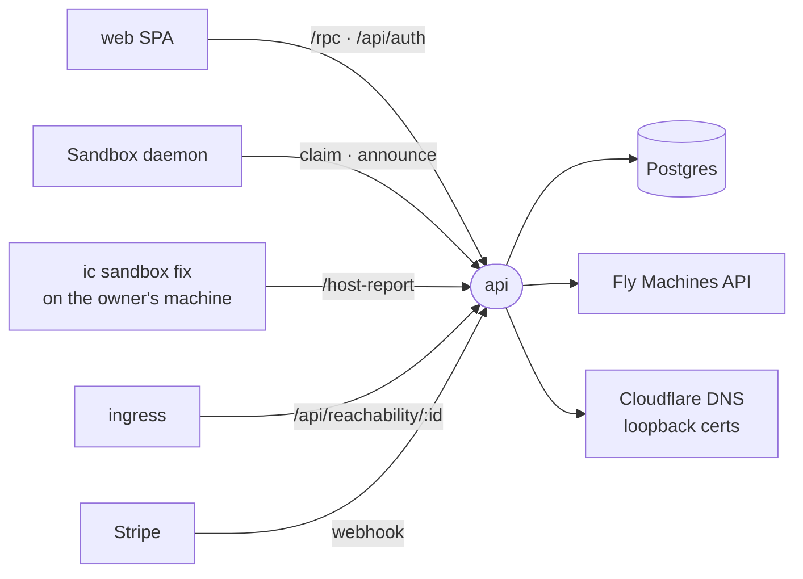

# api

The platform's HTTP server (`@intentic/api`): sign-in, the registry of sandboxes and their addresses, hosted Fly machines, the hosted plan and the agent wallet.


```mermaid
flowchart LR
    spa["web SPA"] -- "/rpc · /api/auth" --> api(["api"])
    daemon["Sandbox daemon"] -- "claim · announce" --> api
    host["ic sandbox fix<br/>on the owner's machine"] -- "/host-report" --> api
    ingress["ingress"] -- "/api/reachability/:id" --> api
    stripe["Stripe"] -- "webhook" --> api
    api --> db[("Postgres")]
    api --> fly["Fly Machines API"]
    api --> cf["Cloudflare DNS<br/>loopback certs"]
```

- Two contracts, both in `@intentic/api-contract`. The editor calls oRPC procedures under `/rpc`; machines (the daemon,
  `ic`, the edge, a builder, the trial's translator) call the plain routes of `PLATFORM_INGRESS`, its ingress table,
  which `src/ingress.ts` registers handlers under. A handler reads its body through the route's schema and refuses with
  `{ "error": … }` and the route's status. (2026-10-05) These routes used to be hand-written here and in the daemon, and
  the boot report kept only the fields a handler listed, so `retrying` and `drift` never reached the editor.
- A registry, never a relay: a daemon announces the address it answers on, and the browser talks to it directly.
  The api stores who owns which sandbox and where it answers; traffic between browser and sandbox never passes
  through it.
- Reachability is a signed grant. The api holds the Ed25519 private key (`INGRESS_SIGNING_KEY`), the edge holds only
  the public half, and a deletion record revokes it (`src/sandbox/reachability.ts`). A trigger on `sandbox` records
  the tunnel id of every deleted row and every rotated token (`SandboxTombstone`), and `GET /api/reachability/:id`
  answers 404 for those alone; an id with neither a row nor a record answers 200 with `known: false`. (2026-10-02)
  Deleting the row used to be the revocation, which made a database that forgot a sandbox (a restore, a wrong
  `DATABASE_URL`) take every sandbox off the edge within a minute.
- When the platform forgets ([platform.md](../../docs/architecture/platform.md#when-the-platform-forgets),
  `src/sandbox/recovery.ts`): every database carries a random identity (`platform_identity`), logged at boot and served
  at `GET /api/identity`. Set `DATABASE_EXPECTED_IDENTITY` and the api refuses to start on any other, before a reaper
  can read a foreign database as orphans; running, it exits if the identity under it changes. An announce for a token
  with no row answers 410 when its id has a deletion record and 404 otherwise, which the daemon keeps retrying. The
  owner gets the row back by adoption: `sandbox.lookup` tells the editor which remembered ids are unknown here,
  `sandbox.adoptionTicket` mints a ten-minute ticket for one, and the daemon spends it at `POST /sandbox/adopt` with the
  grant this platform signed for its token. A deleted sandbox is never adopted.
- A hosted machine is reached only down the tunnel it dials to the edge, with the grant and edge address
  `hostedMachineConfig` puts in its environment; it declares no Fly service, so nothing on Fly routes to it. One that
  dials nothing (stopped, booting) answers the edge's `no-tunnel` verdict, and the editor's wake starts it, re-applying
  its config first when the grant or address is missing or stale (`wakeHosted`). A machine configured while it still
  declared the old replay front door keeps that service until its next config apply, which drops it; it is inert until
  then, since the app has no public address and the edge replays nothing. `GET /api/reachability/:id` answers
  `{ ok, lane }` with no app name: today's edge reads only the status, and `lane` stays for an edge build from before
  replay went, which replays anything not named `tunnel`.
- The hosted lane is one Fly app, machine and volume per sandbox, named `<HOSTED_APP_PREFIX>-<id>`. The background
  jobs started in `src/main.ts` (warm pool, meter, abuse watch, builds, health) take a Postgres advisory lock per run
  (`src/jobs-lock.ts`), so two replicas never double-bill or double-provision.
- Destruction needs a record (2026-10-05; [platform.md](../../docs/architecture/platform.md#when-the-platform-forgets)).
  The daily orphan reaper (`reapHostedOrphans`) destroys an app no row names only when its sandbox's tunnel id is in
  `SandboxTombstone`, or when every machine in it is unclaimed warm stock this platform stamped. Any other unknown app
  is skipped as `forgotten` (beside `live`, `theirs`, `young`, `unknown`, `unreadable`), named in the hosted health log
  and in the admin digest, and never destroyed: an app with no machine used to be collected for its emptiness, which is
  what Fly losing a machine leaves. A pass destroys the oldest of what it may, up to a tenth of the fleet and at least
  three, and defers the rest; it refuses outright only when that is more than a quarter of the fleet. The DNS sweep
  follows the same rule for tunnel and challenge records (`deletedAmong`), at most 100 deletes a pass, and counts the
  rest as `deferred` or `forgotten`.
- A provision or a restart's replacement first reads the app named for the sandbox's token (`heldAppOf`). An app the
  provider still holds is adopted (`adoptHostedApp`): a machine this platform stamped is re-configured onto the volume
  it mounts and started, or a machine is made on the newest volume, in its region and at its size, with no cleanup
  record that could delete the app on a failure. An app holding a machine another deployment or nobody stamped is
  refused (`HostedAppNotOurs`, CONFLICT). The warm pool is asked only when Fly answers that no such app exists, since a
  claim rotates the token away from whatever disk is there.
- The health sweep (`hosted-health.ts`) drops a row whose app Fly answers 404 for (mailed once) or whose machine Fly
  answers 404 for inside a standing app (logged; a rotating slice of forty machines a pass), through
  `forgetHostedMachine`, ten a pass at most, under the app's lock and never for a row mid-build or mid-move. The
  retention sweep holds every person's app to its row once a day (`hosted-app-shape.ts`): a stray machine of ours older
  than half an hour is destroyed (ten a pass), and a foreign machine or a volume no row names is reported in the digest
  and left.
- A hosted sandbox can be made for one folder of the owner's computer. `hostedProvision` takes an optional `project`,
  a folder name held to the rule `ic` and the desktop app hold it to (sandbox-contract's `isProjectDirName`), and the
  machine boots with `SANDBOX_PROJECT_DIR=/work/<project>`, as `ic` starts a project container, so its daemon seeds no
  starter site beside the folder. It is built to order: warm stock's prewarm boot already put the starter site on its
  volume. No row records the folder; the machine's environment does, and every config that replaces a machine's (a
  restart, a rollback, a rebuild, a resize or a move, a restore from the trash, a wake's heal, the state gate's probe)
  carries it over from the config it replaces (`src/sandbox/hosted/hosted-project.ts`). A machine the provider lost is
  rebuilt as an ordinary sandbox. `hostedOffer` answers `projects: true` so an editor knows it may ask; an editor that
  never sends `project` gets an ordinary sandbox, as before. The folder itself arrives from the desktop app, which the
  editor's setup page hands a sync pairing once the machine is reachable: agents work on that copy, and the owner
  brings their changes back from the folder's window.
- A hosted image change goes through the state gate (`src/sandbox/hosted/gate/state-gate.ts`), the hosted half of
  the stored-state promise in [COMPATIBILITY.md](../../COMPATIBILITY.md#stored-data). A restart, a rebuild, a rollback,
  or a wake that heals a stale tunnel first runs the target image's planner (`state-plan.js`) over the machine's own
  volume. It runs in a probe: the same machine with its daemon replaced by a sleep and none of the platform's
  credentials in its environment, asked through Fly's exec once it reads `started`. Fly has no read-only volume mount
  and no machine without a network, so unlike `ic`'s probe (`:ro`, `--network none`) this one mounts the volume
  read-write and can reach the internet; the planner it runs has no write mode, and it is the only command the probe
  runs. A target named by a tag is pinned to a digest first (the registry's, else the one Fly resolved for the probe),
  so the probe and the switch run the same image. A plan that says a conversion would fail, or a planner that crashed
  or answered what is not a plan, keeps the machine on its version and answers the owner in plain words (a restart's
  `CONFLICT`, a build's error). No plan to be had (an image older than the planner, a plan format newer than this
  platform reads, a probe that never comes up) lets the change go ahead as before the gate. The whole gate, probe to
  the new daemon's verdict, holds the app's advisory lock (`hosted-app-lock.ts`): a restart or rebuild waits for another
  change to the machine, a wake that meets one answers `CONFLICT` and is retried by the browser, and the hour meter's
  stop leaves a machine mid-change to its next tick. A resize, a move and a restore from the trash keep the running
  digest, so they have nothing to convert.
- A new version is kept once its daemon says it came up, not once Fly says it started (`gate/daemon-health.ts`). The
  gate asks the daemon's own `/health` through Fly's exec (`/usr/bin/curl -sf` on port 8787, the probe `ic` runs) until
  `boot.ready` with `state.journal` not open, and waits for the sandbox to check in (its announce moving `lastSeenAt`):
  three minutes to answer, ten once the journal was seen open. A version that does not start, exits after starting
  (Fly's restarts included), reads stopped, reports its journal `failed`, never commits it, never answers or never
  checks in is put back on the config and digest it had and started there, and the owner reads why (`HostedImageKept`,
  a restart's `BAD_GATEWAY`). The version put back is started without the wait: it is the one that ran. A rollback that
  fails is logged at error with both images and stamped on the machine's row (`strandedAt`), and the health sweep
  reports and mails it until the sandbox checks in again.
- An image the gate could not judge is on trial (`unprovenImage`): a rebuild applied to a stopped machine, or a version
  whose machine was stopped from outside while its daemon was waited for (a clean exit or a stop someone asked Fly for;
  a crash is not that). Its next start, a wake (`startOnTrial`) or a restart that keeps the digest, runs the same wait,
  and goes back to the image kept before it when the daemon does not come up.
- The machine's row keeps the way back (`gate/gate-row.ts`): an image change that takes records the pinned image it
  replaced and the overlay recipe that image carried (`previousImage`, `previousEnvironmentHash`), and the sandbox list
  says so (`canRollBack`). `hostedRollback` is owner-only and needs nothing of the daemon: it stops the machine, settles
  its stretch and switches to the kept image through the same gate and wait, keeping the image it left as the way
  forward, so a second press goes forward again. It records the platform digest it left (`skippedDigest`: the stock
  image's, or the left overlay's base), and a restart or a wake's heal does not move the machine onto it, nor rebuild an
  overlay on it, while `:stable` still resolves to it. No volume snapshot is taken or restored: the older build's own
  boot restores what the newer one had journaled.
- An overlay's base is a digest, never the tag's string (`build/hosted-build.ts`), since `HOSTED_IMAGE` is the moving
  `:stable`. A build pins its `FROM` to `<tag>@<digest>` as the tag resolves when it starts and keeps that digest
  (`baseDigest`, on the build, the machine and a trashed machine's row). "Already built", "reusable" and "the base
  moved" compare it with what the tag resolves to now, so "Restart & update" on an overlay machine rebuilds the approved
  recipe once `:stable` has moved. An overlay whose base digest was never kept reads as moved and is rebuilt once.
- The routes that change a machine and wait for it (restart, rollback, rebuild, wake, provision, tier change) lift
  Bun's per-request idle timeout (10s by default), which would otherwise close the request with no answer while the
  change went on.
- A daemon's announce may name its `version` (semver, at most 64 characters). It is stored on the sandbox row
  (`daemonVersion`), and an announce that names none, or something else, clears it.
- (2026-10-05) A daemon announces again every hour once registered (`_sandbox/sandbox` `announce.ts`), and every
  accepted announce moves `lastSeenAt`, so it is the sandbox's heartbeat rather than its registration. A 410 is still
  final. An announce may also name which copy it is (`AnnounceBodySchema`: `instance`, minted once per container
  start, `host`, `os`); one that does not leaves the record alone. The row keeps the last two distinct copies
  (`seenInstances`), and when their running stretches overlap by ten minutes or more, `duplicateSince` says since when;
  the owner's `sandbox.list` row carries `duplicateCopies: { hosts, since }` until one copy has been silent an hour
  (`src/sandbox/announce-copies.ts`). A label that is too long is dropped, never a reason to refuse the announce.
- (2026-10-05) `POST /setup/claim` takes optional `host`, `os` and `instance` form fields beside `code`
  (`SetupClaimerSchema`). The first claim that names a machine is kept (`setupClaimedBy`, cleared by every mint and by
  a release), and a claim of the same live code naming a different machine (another name, case aside, or another
  side) is answered 409 with a sentence that says where it was used and what to do; the same machine retrying is let
  through, and so is any machine once the first copy has reported its removal (`/sandbox/farewell`). A claim that names
  nothing is never refused for it. `ic` does not send these fields yet, so until it does nothing is refused.
- (2026-10-05) `POST /sandbox/boot-report` keeps `retrying` and `drift` as the daemon sends them; both used to be
  dropped, so the editor never learned that a reachability probe had given up.
- A sandbox on its owner's own machine can be reported on from outside it, for when the browser cannot reach it
  (`src/sandbox/host-report.ts`). `ic sandbox fix` checks the machine (Docker, WSL, disk, container, daemon, tunnel)
  and posts what it found to `POST /host-report` as `{ sandbox, report }` (`HostReportPostSchema`: the 12-hex tunnel
  id and the report), with `Authorization: Bearer <report key>`. The platform stamps `at` and keeps the newest report
  of each reporter on the row (`hostReport`, as `{ reporters: { <machine|os|env>: report } }`, three reporters at most;
  a row written before holds one bare report and reads as one reporter). `sandbox.list` puts the newest on the owner's
  summary of an own-machine sandbox as `hostReport`, all of them newest first as `hostReporters`, and neither on a
  member's or hosted row. It answers 204 for a report stored, 400 for a malformed body, 401 alike for a wrong key and
  an unknown sandbox, and 404 for a hosted one. A report with the same `stage` and `outcome` as the same reporter's
  stored one, less than two seconds after it, is skipped and still answered 204, so `ic` never retries. A report may
  carry `env` (the WSL distro) and `upkeep` (the machine's upkeep counts), both optional. (2026-10-05) There was one
  slot, so a PC's Windows and WSL agents overwrote each other, and the throttle read one's report as the other's
  repeat.
- (2026-10-10) A sandbox on its owner's own machine can sleep: the machine's keeper stops one nobody has needed for a
  while (`ic sandbox sleep --idle`) and says so in a report carrying `asleep: true`. Waking it goes through the
  platform without the platform calling the machine. `sandbox.wake` on a sandbox intentic does not host stamps
  `wakeRequestedAt` and answers `{ ok: true }`. While any of its sandboxes sleeps, the machine asks
  `POST /host-report/wakes` with `{ asks: [{ sandbox, key }] }` (one tunnel id and report key per sleeper, 64 at most;
  the route takes no other credential). It is answered `{ wake: [tunnel ids] }`: the asks whose key matched and whose
  request is under ten minutes old. Each request is cleared as it is handed out, pinned to the stamp read, so it is
  delivered once. A sleep reported right after a healthy report with the same stage and outcome is not throttled.
- The report key is lowercase hex HMAC-SHA256 over `intentic/host-report/v1` (`HOST_REPORT_KEY_LABEL`), keyed with
  the connect token. `ic` derives it from the container's env and keeps it, so the machine agent's own runs report
  with no code. The platform derives it from the token it keeps encrypted and compares in constant time, and it
  grants that one write and nothing else. The recovery panel's command carries a fix code instead
  (`sandbox.fixCode`: owner-only, NOT_FOUND for a hosted or removed sandbox, thirty minutes, the setup code's
  generator, each mint replacing the last), which `ic` redeems at `POST /host-report/claim` (`{ code }`) for
  `{ sandbox, key }`. The code stays redeemable until it expires; unknown, expired, removed and hosted all answer 404.
  Neither route is rate-limited, as no route of this app is, and a fix code carries the setup code's 65 bits. Releasing
  a hosted machine rotates the connect token, so it clears both columns with the setup ones.
- Deleting an account runs one erase path whichever side asks (`src/account-erase.ts`): Better Auth's `beforeDelete`
  for the owner's own deletion, `deleteUserAccount` for an operator's. Before the cascade, in one transaction, it queues
  every Fly app the account owns (live machines, trashed sandboxes, a release's held volume, a provision in flight)
  into `HostedCleanup` due now, queues the Stripe customer and subscription into `stripe_erasure`, moves the hosted
  standing onto `hosted_standing`, and deletes the sandboxes so a provision mid-flight cleans up after itself. Then it
  destroys the apps and deletes the Stripe customer at once, best-effort. The cleanup sweep retries a failed app every
  minute and is not held back by the orphan reaper's caps; the retention sweep retries a failed Stripe customer daily.
  Running it again after a partial failure is safe: the queues are upserts, and the standing is moved, not copied.
- A deleted account's hosted standing outlives it (`sandbox/hosted/abuse/carried-standing.ts`): the suspension, the
  abuse watch's strike count and the month's free minutes, keyed by HMAC-SHA256 of the Google subject under a key
  derived from `BETTER_AUTH_SECRET` with HKDF and a fixed label. The suspension gate, the hour meter and the abuse watch
  add it to whichever account's Google subject hashes to it, so deleting an account and signing in again does not
  reset them; an operator's lift clears a carried suspension too. The retention sweep clears the standing twelve months
  after its latest change, the minutes when their month ends, and the row once both are gone. Rotating
  `BETTER_AUTH_SECRET` orphans every record. (2026-09-29: derived rather than a new env var, so no deployment has to
  carry one more secret. A dedicated key would survive a session-secret rotation, at the cost of one more thing to set.)
- `src/config.ts` is the one config schema; each field is an env var in SCREAMING_SNAKE. A lane whose credential is
  unset (Stripe, APNs, trial keys, Fly) is switched off rather than failing the boot.
- Bun runs the TypeScript source; there is no build. The image applies migrations and then refuses to start if the
  database differs from `schema.prisma` ([Dockerfile](Dockerfile)).
- [specs](specs) holds a TLA+ model of the hosted awake-hour meter.

## Layout

| Directory | What it holds |
| --- | --- |
| `src/sandbox` | Sandbox routes, reachability grants, loopback DNS, trash; `hosted/` runs the Fly lane |
| `src/sandbox/hosted` | Fly client, provisioning, pool, meter, builds, migrations between machines, the Stripe plan |
| `src/admin` | Operator panel routes behind `ADMIN_EMAILS`, each call audited |
| `src/desktop` | Desktop sign-in handoff over the `intentic://` deep link |
| `src/fleet` | `/fleet`: an API token lets a sandbox create sandboxes for its owner |
| `src/invite` | Emailed invitations to share a sandbox |
| `src/me` | The caller's profile and GDPR data export |
| `src/tokens` | Account-level API tokens |
| `src/push-relay` | APNs push relay for native installs |
| `src/trial` | Free-trial model API, OpenAI-compatible, on the platform's credential |
| `src/wallet` | Agent wallet: payments signed by a custody provider under per-member caps |
| `src/e2e` | Suites against real Fly and Stripe, gated by `INTENTIC_E2E` |

## Key files

- [src/main.ts](src/main.ts) — boot: config, Prisma, the background jobs, `Bun.serve`.
- [src/app.ts](src/app.ts) — the Hono app: middleware, daemon-facing routes, sub-apps, the oRPC mount at `/rpc`.
- [src/ingress.ts](src/ingress.ts) — serves a machine-facing route under its entry in the contract's ingress table.
- [src/router.ts](src/router.ts) — the oRPC router, one entry per domain, shaped by `@intentic/api-contract`.
- [src/config.ts](src/config.ts) — every setting, its env var and its default.
- [src/sandbox/hosted/hosted.ts](src/sandbox/hosted/hosted.ts) — provisioning and waking hosted machines.
- [src/sandbox/reachability.ts](src/sandbox/reachability.ts) — the hostname and signed grant each sandbox gets.

## Commands

```sh
pnpm db:up                             # repo root: Postgres in Docker, migrations applied once DATABASE_URL is checked to reach it
pnpm --filter @intentic/api dev        # watch mode, reads the root .env
pnpm --filter @intentic/api test
pnpm --filter @intentic/api fleet      # read-only: what the platform runs on Fly, and for whom
```

## Repair (`POST /api/repair/turn`)

Session-authenticated turn endpoint for the desktop Repair agent. Tool definitions and the system prompt live on the server; the app executes tool calls locally. Allowance is **48 turns per user per UTC day** by default (`REPAIR_*` config, separate from the sandbox trial). Disabled when no repair/trial model keys are configured.
