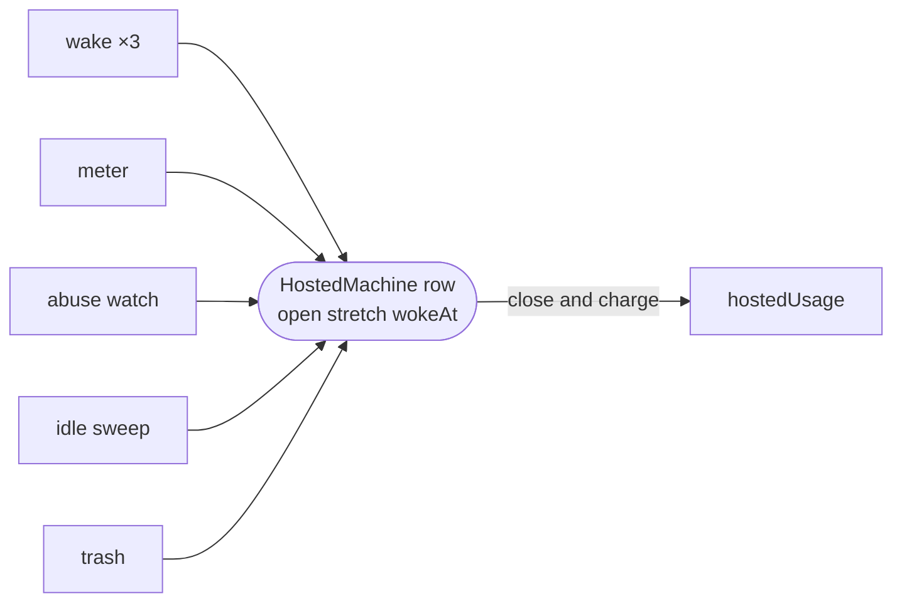

# specs

TLA+ specs of the api's concurrent billing paths, model-checked with TLC to show that racing writers charge each hosted awake stretch exactly once.



- `HostedStretch.tla` models one hosted machine: its Fly state, its `HostedMachine` row and the stretch that row's
  `wokeAt` holds open. The writers are processes: three racing wakes (`sandbox.routes.ts`), the meter
  (`hosted-meter.ts`), the abuse watch (`hosted-abuse.ts`), the idle sweep (`hosted-idle.ts`) and trash
  (`sandbox-trash.ts`). The machine can also stop itself or vanish from Fly. Each shared step is one transaction
  under the row lock, so the model treats it as one atomic action.
- `HostedStretch.cfg` checks `TypeOK`, `NoDoubleCharge` (no stretch reaches `hostedUsage` twice), `NoLostStretch`
  (every opened stretch is charged or still open on the row) and `RunningIsMetered` (with nothing mid-flight, a
  running machine has a row holding an open stretch). `SYMMETRY` and `VIEW` shrink the state space without changing
  which states violate a property.
- Known not to hold: `NoDestroyWhileRunning`, "the idle sweep never destroys a machine somebody has woken". The sweep
  reads the machine stopped (`IdleSettle`) and destroys it in a later step (`IdleDestroy`), so a wake that starts
  the machine between the two loses it. It is left out of the `.cfg`; add it to `INVARIANTS` to get the trace.
- Code and tests for a modelled step cite `specs/HostedStretch.tla`, for example `src/sandbox/hosted/hosted-usage.ts`.

## Running TLC

TLC ships in `tla2tools.jar` from the TLA+ tools and needs a JVM; neither is part of the repo toolchain or CI.

```sh
cd _platform/api/specs
java -cp tla2tools.jar tlc2.TLC -config HostedStretch.cfg HostedStretch.tla
```
