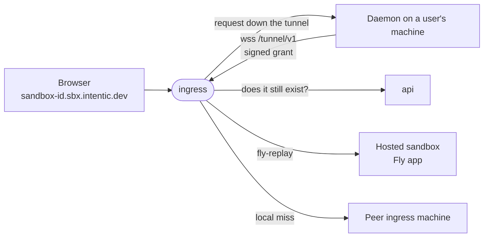

# ingress

The edge every sandbox hostname points at: it carries browser traffic down tunnels that sandboxes dial, and hands hosted sandboxes to their Fly app by replay.



- No database and nothing durable: the tunnel registry is an in-memory map, so a restart drops every tunnel and each
  daemon redials. The newest tunnel for an id displaces the older one.
- Holds only the platform's Ed25519 public key, so it verifies grants and can never mint one. Revocation is a
  cached, fail-open `GET /api/reachability/<id>` to the api, at registration and on a miss.
- Routes on each request's Host, since HTTP/2 coalesces many hostnames onto one connection.
- Machines behind the one address find each other through Fly's internal DNS and forward a miss once to whichever
  holds the tunnel, over private port 8081.
- A hosted sandbox gets `fly-replay: app=<prefix>-<id>`, which Fly's proxy caches per hostname.

## Key files

- [src/main.ts](src/main.ts) — boot: refuses to start without the public key, wires peers, registry and cluster.
- [src/server.ts](src/server.ts) — the one port: tunnel registration, Host routing, replay, `/health`.
- [src/cluster.ts](src/cluster.ts) — which peer holds which tunnel, and forwarding a miss to it.
- [src/revocation.ts](src/revocation.ts) — the cached, fail-open question to the api.
- [src/config.ts](src/config.ts) — every setting and its env var.
- [fly.toml](fly.toml) — the machine shape, replay cache, connection limits and health check.

## Commands

```sh
pnpm --filter @intentic/ingress dev
pnpm --filter @intentic/ingress test   # suites, then a real tunnel under bun (scripts/runtime-smoke.ts)
```

## Deploying

The edge runs on Fly as `intentic-ingress`, apart from the Komodo stack that holds the api and web. On a push to
main, CI's `images-platform` job pushes `ghcr.io/intentic/ingress` and runs
[deploy-ingress.sh](../../_tools/scripts/platform/deploy-ingress.sh), which runs `flyctl deploy` with
[fly.toml](fly.toml) and waits until `/health` reports the build baked into the image. An empty `FLY_API_TOKEN`
skips it. What the script does not set:

```sh
fly scale count 1 --region <region> -a intentic-ingress    # regions live here, not in fly.toml
fly secrets set -a intentic-ingress INGRESS_PUBLIC_KEY="$(openssl pkey -in ingress-key.pem -pubout)" \
    PLATFORM_URL=<api origin> HOSTED_APP_PREFIX=intentic-sbx
fly orgs cross-network-replays status                      # must be on for hosted sandboxes
```

| Setting | Why |
| --- | --- |
| `INGRESS_PUBLIC_KEY` | Public half of the api's `INGRESS_SIGNING_KEY`; the process exits without it. |
| `PLATFORM_URL` | The api, asked whether a sandbox still exists; unset turns revocation off. |
| `HOSTED_APP_PREFIX` | Must equal the api's; unset, `/health` reports `replay:false` and hosted sandboxes answer 502. |

- Run one machine per region where owners of tunnel-lane sandboxes are. `fly.toml` never auto-stops them, since a
  stopped machine drops every tunnel it holds.
- The app must sit in the same Fly org as the hosted sandbox apps, and the org must allow cross-network replays:
  each hosted app gets its own private network (`createApp` in the api's `src/sandbox/hosted/fly/fly.ts`).
- Never publish `INGRESS_INTERNAL_PORT` (8081): binding only the private address is the peer protocol's one lock.
