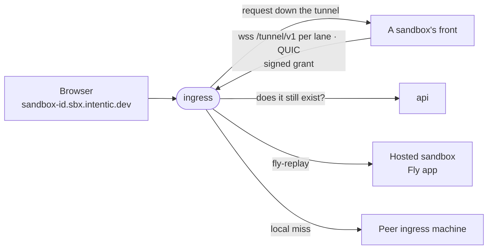

# ingress

The edge every sandbox hostname points at: it carries browser traffic down tunnels that sandboxes dial, over TCP or QUIC, and hands hosted sandboxes to their Fly app by replay.



- A Rust crate that builds the same [tunnel](../../_sandbox/front/crates/tunnel) crate as the sandbox's front, so both
  ends of a tunnel are one implementation of the wire.
- No database and nothing durable: the tunnel registry is an in-memory map, so a restart drops every tunnel and each
  front redials. The newest tunnel for an id displaces the older one.
- Holds only the platform's Ed25519 public key, so it verifies grants and can never mint one. Revocation is a
  cached, fail-open `GET /api/reachability/<id>` to the api, at registration and on a miss.
- Routes on each request's Host, since HTTP/2 coalesces many hostnames onto one connection. A sandbox with no tunnel
  answers 502 with an `x-intentic-edge` header naming why (`edge-verdict.ts` in the contract), which the editor reads.
- A front dials two WebSocket lanes, and a QUIC connection beside them wherever UDP reaches the edge. The lane a
  request rides comes from the daemon's routes (`tunnel-lanes.json`), so a transfer never queues a keystroke; QUIC is
  preferred while held, each request a stream of its own.
- With the certificate held here (below), browsers get HTTP/3 on the same port, and the editor's terminals ride
  WebTransport: a session opened at `/system/transport` on a sandbox's address, each stream served as one HTTP/1.1
  connection to that address whatever Host it writes.
- Machines behind the one address find each other through Fly's internal DNS and forward a miss once to whichever
  holds the tunnel, over private port 8081.
- A hosted sandbox gets `fly-replay: app=<prefix>-<id>`, which Fly's proxy caches per hostname.

## Key files

- [src/edge.rs](src/edge.rs) — the tunnel door, the grant check, per-request Host routing, replays and verdicts.
- [src/session.rs](src/session.rs) — one held tunnel: a request per stream, an upgrade as a CONNECT.
- [src/cluster.rs](src/cluster.rs) — which peer holds which tunnel, the holds protocol and the one-hop rule.
- [src/quic.rs](src/quic.rs) — the UDP door: a front's QUIC tunnel or a browser's HTTP/3, told apart by ALPN.
- [src/webtransport.rs](src/webtransport.rs) — a browser's session and its streams, pinned to the session's sandbox.
- [src/config.rs](src/config.rs) — every setting and its env var.

## Commands

```sh
cargo test                                        # every suite, over real sockets
pnpm --filter @intentic/ingress docker:release    # the image, the tunnel crate and lane table passed as build contexts
```

## Deploying

The edge runs on Fly as `intentic-ingress`, apart from the Komodo stack that holds the api and web. On a push to
main, CI's `images-platform` job pushes `ghcr.io/intentic/ingress` and runs
[deploy-ingress.sh](../../_tools/scripts/platform/deploy-ingress.sh), which runs `flyctl deploy` with
[fly.toml](fly.toml) and waits until `/health` reports the build baked into the image. An empty `FLY_API_TOKEN`
skips it. What the script does not set:

```sh
fly scale count 1 --region <region> -a intentic-ingress    # regions live here, not in fly.toml
fly secrets set -a intentic-ingress INGRESS_PUBLIC_KEY="$(openssl pkey -in ingress-key.pem -pubout)" \
    PLATFORM_URL=<api origin> HOSTED_APP_PREFIX=intentic-sbx
fly orgs cross-network-replays status                      # must be on for hosted sandboxes
```

| Setting | Why |
| --- | --- |
| `INGRESS_PUBLIC_KEY` | Public half of the api's `INGRESS_SIGNING_KEY`; the process exits without it. |
| `PLATFORM_URL` | The api, asked whether a sandbox still exists; unset turns revocation off. |
| `HOSTED_APP_PREFIX` | Must equal the api's; unset, `/health` reports `replay:false` and hosted sandboxes answer 502. |

- Run one machine per region where owners of tunnel-lane sandboxes are. `fly.toml` never auto-stops them, since a
  stopped machine drops every tunnel it holds.
- The app must sit in the same Fly org as the hosted sandbox apps, and the org must allow cross-network replays:
  each hosted app gets its own private network (`createApp` in the api's `src/sandbox/hosted/fly/fly.ts`).
- Never publish `INGRESS_INTERNAL_PORT` (8081): binding only the private address is the peer protocol's one lock.
- Roll the edge before the sandboxes that dial it: an edge older than lanes reads a front's second dial as a newer
  tunnel for the same sandbox, and the two lanes displace each other every minute.

### Terminating TLS at the edge

Holding the certificate here is what lets UDP (the QUIC tunnel, HTTP/3, WebTransport) reach the edge, since Fly's
HTTP handler carries none. The platform orders one wildcard for the fleet (the api's `edge-certificate.ts`) and hands
it to an edge presenting `INGRESS_PLATFORM_TOKEN`. Switch it on in this order:

1. Give hosted machines a grant and restart them, so each dials in; one that has not is replayed to until step 3.
2. Set the same `INGRESS_PLATFORM_TOKEN` on the api and here, and remove any `_acme-challenge.<zone>` CNAME. The api
   logs `edge certificate issued`.
3. `fly secrets set INGRESS_TLS_PORT=8443 INGRESS_PROXY_PROTOCOL=true`, and replace `[http_service]` in fly.toml with
   raw TCP on 443 (`handlers = ["proxy_proto"]`, version 2) and a redirect on 80.
4. For UDP: `fly ips allocate-v4`, a UDP service from 443 to 8443, and `INGRESS_QUIC_PORT=8443`,
   `INGRESS_QUIC_HOST=fly-global-services`, `INGRESS_ALT_SVC='h3=":443"; ma=86400'`.
5. `fly certs remove '*.sbx.intentic.dev'`.

From then on a hosted sandbox is reached down the tunnel it dials like every other, and a stopped one answers the
`no-tunnel` verdict the editor's wake acts on.
