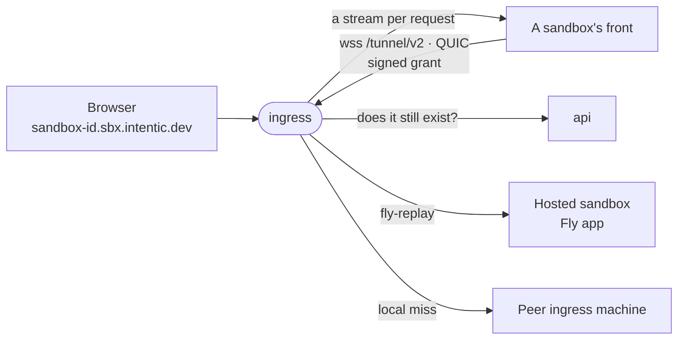

# ingress

The edge every sandbox hostname points at: it carries browser traffic down tunnels that sandboxes dial, over TCP or QUIC, and hands hosted sandboxes to their Fly app by replay.



- A Rust crate that builds the same [tunnel](../../_sandbox/front/crates/tunnel) and [relay](../../_shared/relay)
  crates as the sandbox's front, so both ends of a tunnel are one implementation of the wire and of how HTTP crosses
  it.
- No database and nothing durable: the tunnel registry is an in-memory map, so a restart drops every tunnel and each
  front redials. The newest tunnel for an id displaces the older one.
- Holds only the platform's Ed25519 public key, so it verifies grants and can never mint one. Revocation is a
  cached, fail-open `GET /api/reachability/<id>` to the api, at registration and on a miss.
- Routes on each request's Host, since HTTP/2 coalesces many hostnames onto one connection. A sandbox with no tunnel
  answers 502 with an `x-intentic-edge` header naming why (`edge-verdict.ts` in the contract), which the editor reads.
- What the edge serves beyond HTTPS over TCP is declared, never probed for: binding the QUIC door
  (`INGRESS_QUIC_PORT`) is what makes it answer every tunnel's upgrade with `x-intentic-transports: quic, h3,
  webtransport` and list the same under `transports` on `/health`. Undeclared means not served, which is what every
  older edge says.
- A tunnel is a carrier of byte streams, and the edge opens one per request, carrying plain HTTP/1.1 so an upgrade is
  itself (`session.rs`, `relay::exchange`). A front dials two WebSockets at `/tunnel/v2`, `interactive` and `bulk`,
  each carrying yamux, and a QUIC connection beside them once the edge's answer declares `quic`; QUIC is preferred while
  held, and there a stream that sends a megabyte without pausing yields to the others until it pauses.
- Over TCP, streams on one connection still share its congestion window and its losses, so a transfer rides the bulk
  socket: any preview's request, and a daemon route the front announced on its upgrade (`x-intentic-bulk`, the daemon's
  RouteMeta `lane`). The edge compiles in no route table, so a route's socket follows the daemon that serves it.
- Fronts that predate `/tunnel/v2` still dial `/tunnel/v1`, two lanes each an h2 session, an upgrade carried as a
  CONNECT whose h1 head rides under `x-ingress-*`. [legacy.rs](src/legacy.rs) alone speaks it, reading those fronts'
  transfer routes from the list frozen with the door, and goes once no front dials it.
- The front pings its WebSockets every 15 s and the edge only listens; either end drops a peer silent for 45 s. A QUIC
  connection's own keep-alive and idle timeout, on the same cadence, are its only liveness.
- With the certificate held here (below), browsers get HTTP/3 on the same port, and the editor's terminals ride
  WebTransport where the platform relays the edge's declaration on the sandbox's row: a session opened at
  `/system/transport` on a sandbox's address, each stream served as one HTTP/1.1 connection to that address whatever
  Host it writes. The editor speaks a plain WebSocket on the stream, so any front or daemon serving `/system/terminal`
  serves it.
- Machines behind the one address find each other through Fly's internal DNS and forward a miss once to whichever
  holds the tunnel, over private port 8081.
- A hosted sandbox gets `fly-replay: app=<prefix>-<id>`, which Fly's proxy caches per hostname.

## Key files

- [src/edge.rs](src/edge.rs) — the tunnel door, the grant check, per-request Host routing, replays and verdicts.
- [src/session.rs](src/session.rs) — one held tunnel: a carrier of streams, each one HTTP/1.1 exchange.
- [src/cluster.rs](src/cluster.rs) — which peer holds which tunnel, the holds protocol and the one-hop rule.
- [src/quic.rs](src/quic.rs) — the UDP door: a front's QUIC tunnel or a browser's HTTP/3, told apart by ALPN.
- [src/webtransport.rs](src/webtransport.rs) — a browser's session and its streams, pinned to the session's sandbox.
- [src/config.rs](src/config.rs) — every setting and its env var.

## Commands

```sh
cargo test                                        # every suite, over real sockets
pnpm --filter @intentic/ingress docker:release    # the image, the tunnel, browser-wire and relay crates as build contexts
```

## Deploying

The edge runs on Fly as `intentic-ingress`, apart from the Komodo stack that holds the api and web. On a push to
main, CI's `images-platform` job pushes `ghcr.io/intentic/ingress` and runs
[deploy-ingress.sh](../../_tools/scripts/platform/deploy-ingress.sh), which runs `flyctl deploy` with
[fly.toml](fly.toml) and waits until `/health` reports the build baked into the image and lists the tunnel door this
checkout's fronts dial. An empty `FLY_API_TOKEN` skips it. The script deploys another config when named (`INGRESS_FLY_CONFIG`, or its first argument), and for one that
terminates TLS it also requires `/health` to declare `quic`, `h3` and `webtransport`. What the script does not set:

```sh
fly scale count 1 --region <region> -a intentic-ingress    # regions live here, not in fly.toml
fly secrets set -a intentic-ingress INGRESS_PUBLIC_KEY="$(openssl pkey -in ingress-key.pem -pubout)" \
    PLATFORM_URL=<api origin> HOSTED_APP_PREFIX=intentic-sbx
fly orgs cross-network-replays status                      # must be on for hosted sandboxes
```

| Setting | Why |
| --- | --- |
| `INGRESS_PUBLIC_KEY` | Public half of the api's `INGRESS_SIGNING_KEY`; the process exits without it. |
| `PLATFORM_URL` | The api, asked whether a sandbox still exists; unset turns revocation off. |
| `HOSTED_APP_PREFIX` | Must equal the api's; unset, `/health` reports `replay:false` and hosted sandboxes answer 502. |

- Run one machine per region where owners of tunnel-lane sandboxes are. `fly.toml` never auto-stops them, since a
  stopped machine drops every tunnel it holds.
- The app must sit in the same Fly org as the hosted sandbox apps, and the org must allow cross-network replays:
  each hosted app gets its own private network (`createApp` in the api's `src/sandbox/hosted/fly/fly.ts`).
- Never publish `INGRESS_INTERNAL_PORT` (8081): binding only the private address is the peer protocol's one lock.
- An edge serves both doors and lists them on `/health` (`"doors":["/tunnel/v1","/tunnel/v2"]`), and a front dials
  only `/tunnel/v2`, with no fallback. So no sandbox image moves onto a tag sandboxes pull (`latest` in CI's
  `images-merge`, `stable` in the release and in `rollback.yml`) until the live edge lists the door that image's front
  dials: [require-edge-door.sh](../../_tools/scripts/image/require-edge-door.sh) asks `/health`, waits up to 30 minutes
  in CI for the same push's edge roll, and fails closed. deploy-ingress.sh asks the same after every roll. A
  self-hosted deployment publishing its own images names its edge with `EDGE_HEALTH_URL`.

## Going live: terminating TLS at the edge

Holding the certificate here is what lets UDP (the QUIC tunnel, HTTP/3, WebTransport) reach the edge, since Fly's
HTTP handler carries none. The platform orders one wildcard for the fleet (the api's `edge-certificate.ts`) and hands
it to an edge presenting `INGRESS_PLATFORM_TOKEN`. [fly.edge-tls.toml](fly.edge-tls.toml) is the edge's shape once it
does: raw TCP on 443 with PROXY v2 headers, a redirect on 80, UDP 443 to the QUIC door. It is a separate file because
CI deploys `fly.toml` on every push, and `tests/fly_configs.rs` holds the two equal outside their services. Under it
there is no replay: a hosted sandbox is reached down the tunnel it dials, like every other.

Run steps 3 to 5 in one sitting. Between them a push to main redeploys `fly.toml` with the staged secrets, which keeps
everything reachable over TCP but declares a UDP door nothing routes to; fronts and editors then retry QUIC and
WebTransport on their backoff while the WebSockets carry everything. That is safe, only wasteful.

The shell below assumes:

```sh
export FLY_API_TOKEN="$FLY_API_TOKEN_FLY"         # org intentic: the edge and every hosted app
EDGE=https://ingress.sbx.intentic.dev
fly_api() { curl -fsS -H "Authorization: Bearer $FLY_API_TOKEN" "https://api.machines.dev/v1$1"; }
```

`flyctl` is `curl -L https://fly.io/install.sh | sh`. Every edge deploy restarts every edge machine: each tunnel drops
with 1001 and redials within seconds, and an open terminal or event stream reconnects. Nothing in this runbook
restarts a sandbox except a wake (step 1) and whoever presses Restart.

### Before step 0

- **Validate the TLS shape**, which needs the token: `flyctl config validate -c _platform/ingress/fly.edge-tls.toml`
  and the same for `fly.toml`. Both must answer valid. `cargo test --test fly_configs` holds them equal offline.
- **Nothing on a new front's path needs `/tunnel/v1` or the old lane manifest.** A front dials `/tunnel/v2` whatever
  path its daemon names (`door` in the front's `tunnel.rs`). The edge compiles in no route table: the v2 bulk socket
  carries the routes the front announces, and the frozen list in `legacy.rs` serves `/tunnel/v1` fronts only.

**0. Main green, push, the edge rolls, images follow.** Once main's CI passes locally (the `preflight` fix), push:

```sh
git push origin main
gh run watch "$(gh run list --workflow ci.yml --branch main --limit 1 --json databaseId -q '.[0].databaseId')"
```

CI does it in this order. `images-platform` rolls the api and web through Komodo (the api now heals hosted machines on
wake, step 1), then the edge through deploy-ingress.sh with `fly.toml`. That job fails unless `/health` reports the
image's build and lists `/tunnel/v2`. `images-merge` moves `latest` only once the live edge lists `/tunnel/v2`, and a
release moves `stable` only then too: its log line is `the edge at https://ingress.sbx.intentic.dev/health serves
/tunnel/v2`. Check:

```sh
curl -fsS $EDGE/health | jq '{build, doors, transports, replay, tunnels}'
# doors ["/tunnel/v1","/tunnel/v2"], transports [], replay true, build = the pushed ingress image's INGRESS_BUILD
flyctl logs -a intentic-ingress --no-tail | grep '"message":"tunnel registered"' | tail   # "door":"v1 …" or "v2 …"
gh release view --json tagName -q .tagName                                           # the version stable now is
docker buildx imagetools inspect ghcr.io/intentic/sandbox:stable | grep -m1 Digest   # equal to the next line's
docker buildx imagetools inspect "ghcr.io/intentic/sandbox:$(gh release view --json tagName -q .tagName | tr -d v)" | grep -m1 Digest
```

`tunnels` climbs back to where it was within a minute. **Restarts:** the edge machines, and the api and web for a
few seconds. No sandbox restarts: one on an older image keeps dialling `/tunnel/v1`, which this edge still serves.
**Rollback:** images first, then the edge, because an edge without `/tunnel/v2` strands every front that already
pulled one. `gh workflow run rollback.yml -f version=<previous>` puts `stable` back (it refuses unless the live edge
serves that version's door, which it does). Then take the previous ingress image from `flyctl releases -a
intentic-ingress --image` and run `INGRESS_IMAGE=<that image> bash _tools/scripts/platform/deploy-ingress.sh`, which
fails at the door check on an edge older than `/tunnel/v2`; that failure is expected on this path.

**1. Hosted machines heal on their next wake, and nobody presses Restart.** A hosted machine dials once it runs an
image with intentic-front (aa02061469 or later) and its config carries `INGRESS_URL` and `SANDBOX_GRANT`. A wake
through the api (the editor calls it whenever a hosted sandbox does not answer, and the edge's `no-tunnel` verdict is
such an answer) now reads the machine's config first. When the pair is missing or stale, the wake re-applies the
whole config the way Restart does: the grant, and today's `stable` digest for a stock machine, then starts it and
meters it like any wake (`wakeHosted` in the api's `hosted.ts`). So a machine configured before 71dbfb7145 is
reachable from its first wake after the flip. List where the fleet stands:

```sh
for app in $(fly_api "/apps?org_slug=intentic" | jq -r '.apps[].name | select(startswith("intentic-sbx-"))'); do
    fly_api "/apps/$app/machines" | jq -r --arg app "$app" '.[] | select(.config.metadata.intentic_role == "sandbox")
        | "\($app) \(.id) \(.state) grant=\(.config.env.SANDBOX_GRANT != null) \(.config.image)"'
done
```

Prove the heal on one sandbox you own before the flip: open it in the editor. Its machine wakes, and the line above
then says `grant=true` on an image under `ghcr.io/intentic/sandbox@sha256:` equal to `stable`'s digest. The api logs
`hosted wake: the machine's tunnel grant or edge address was missing or stale; its config was re-applied`. The machine
then logs that it dialled (`flyctl logs -a <app> --no-tail | grep 'reachable: the ingress tunnel is registered'`), and
the edge logs `tunnel registered` with its 12-hex id. **Restarts:** only the machine being woken, and only when it was
healed: a wake then boots onto the new image, one image pull. **Rollback:** nothing to undo, since dialling in is
additive and the machine stays reachable by replay until step 5.

An image not under `ghcr.io/intentic/sandbox` is an environment overlay (`registry.fly.io/…`). The heal gives it the
grant but keeps its overlay, and an overlay built on a base older than aa02061469 has no front to dial with. After
step 5 such a sandbox answers `no-tunnel` until its owner rebuilds the environment (the Environment card). Check each
one's build date against 2026-09-24 in the api's `HostedBuild` rows before the flip, and tell those owners.

**2. The certificate is issued.** Make a token and keep it for step 3:

```sh
TOKEN="$(openssl rand -hex 32)"
```

In Cloudflare, zone `intentic.dev`, first note the value of the `_acme-challenge.sbx.intentic.dev` CNAME (Fly's DNS-01
delegation for its own `*.sbx.intentic.dev` certificate), then delete it, since while it exists the api cannot publish
its TXT challenge there:

```sh
ZONE_ID="$(curl -fsS -H "Authorization: Bearer $CLOUDFLARE_API_TOKEN" 'https://api.cloudflare.com/client/v4/zones?name=intentic.dev' | jq -r '.result[0].id')"
curl -fsS -H "Authorization: Bearer $CLOUDFLARE_API_TOKEN" \
    "https://api.cloudflare.com/client/v4/zones/$ZONE_ID/dns_records?name=_acme-challenge.sbx.intentic.dev" |
    jq '.result[] | {id, type, content}'                                  # keep this output
curl -fsS -X DELETE -H "Authorization: Bearer $CLOUDFLARE_API_TOKEN" \
    "https://api.cloudflare.com/client/v4/zones/$ZONE_ID/dns_records/<id>"
```

Check: `dig +short CNAME _acme-challenge.sbx.intentic.dev` answers nothing. Fly's certificate keeps serving until it
would renew, about thirty days before it expires (`flyctl certs show '*.sbx.intentic.dev' -a intentic-ingress`), so
finish step 5 well inside that.

In Komodo, stack `intentic-platform`, add `INGRESS_PLATFORM_TOKEN=$TOKEN` to its environment. The api also needs
`INTENTIC_CLOUDFLARE_API_TOKEN` and `INTENTIC_CLOUDFLARE_ZONE=intentic.dev`, already set for loopback certificates.
Then redeploy it:

```sh
curl -fsS -X POST https://komodo.radarsu.com/execute -H 'Content-Type: application/json' \
    -H "X-Api-Key: $KOMODO_API_KEY" -H "X-Api-Secret: $KOMODO_API_SECRET" \
    -d '{ "type": "DeployStack", "params": { "stack": "intentic-platform" } }'
```

Check: the api logs `edge certificate issued` for `sbx.intentic.dev` within a few minutes, and

```sh
curl -fsS -H "authorization: Bearer $TOKEN" https://api.intentic.dev/api/ingress/certificate |
    jq -r .certificate | openssl x509 -noout -subject -enddate -ext subjectAltName -fingerprint -sha256
```

names `*.sbx.intentic.dev` and `sbx.intentic.dev`. Keep the fingerprint for step 5. A 404 `no certificate has been
issued` means the order has not finished or has failed (the api logs why and retries every six hours). **Restarts:**
the api and web, for a few seconds; sandboxes and tunnels are untouched. **Rollback:** remove the variable and
redeploy the stack; the stored certificate is inert without it. Recreate the CNAME (the output you kept) only if you
are abandoning the switch, so that Fly can renew its own.

**3. Stage the edge's secrets**, without a restart:

```sh
flyctl secrets list -a intentic-ingress        # PLATFORM_URL must already be https://api.intentic.dev
flyctl secrets set --stage -a intentic-ingress \
    INGRESS_PLATFORM_TOKEN="$TOKEN" \
    INGRESS_TLS_PORT=8443 INGRESS_PROXY_PROTOCOL=true \
    INGRESS_QUIC_PORT=8443 INGRESS_QUIC_HOST=fly-global-services \
    INGRESS_ALT_SVC='h3=":443"; ma=86400'
```

Check: `flyctl secrets list -a intentic-ingress` lists them as staged, and `flyctl status -a intentic-ingress` shows
the machines' uptime unchanged. **Restarts:** nothing. **Rollback:** `flyctl secrets unset --stage -a intentic-ingress
INGRESS_PLATFORM_TOKEN INGRESS_TLS_PORT INGRESS_PROXY_PROTOCOL INGRESS_QUIC_PORT INGRESS_QUIC_HOST INGRESS_ALT_SVC`.

**4. A dedicated IPv4 for UDP**, which Fly delivers to no shared address:

```sh
flyctl ips allocate-v4 -a intentic-ingress
flyctl ips list -a intentic-ingress
```

Check: `dig +short ingress.sbx.intentic.dev` and `dig +short sandbox-000000000000.sbx.intentic.dev` answer the new v4.
A CNAME to `intentic-ingress.fly.dev` follows by itself; an A record in Cloudflare must be changed to it (the
`dns_records` call above, `?name=*.sbx.intentic.dev`, then a `PATCH` of `content`). **Restarts:** nothing, and TCP keeps
working on either address. **Rollback:** point any A record back, then `flyctl ips release <v4> -a intentic-ingress`.

**5. Deploy the TLS shape.** From a checkout of main:

```sh
INGRESS_FLY_CONFIG=_platform/ingress/fly.edge-tls.toml bash _tools/scripts/platform/deploy-ingress.sh
```

This applies the staged secrets and the new services. The script fails unless the new build answers, lists
`/tunnel/v2`, and declares `quic`, `h3` and `webtransport`. Then check each layer:

```sh
# The edge holds the platform's certificate, not Fly's: the fingerprint from step 2.
openssl s_client -connect ingress.sbx.intentic.dev:443 -servername ingress.sbx.intentic.dev </dev/null 2>/dev/null |
    openssl x509 -noout -fingerprint -sha256
curl -sI $EDGE/health | grep -i alt-svc                        # h3=":443"
curl -sI http://ingress.sbx.intentic.dev/health | head -1      # a redirect to https
docker run --rm ymuski/curl-http3 curl -sI --http3-only $EDGE/health | head -1   # HTTP/3 200 (any curl built with HTTP/3)

# QUIC tunnel sessions: the edge registers one per front that holds QUIC, beside its WebSockets.
flyctl logs -a intentic-ingress --no-tail | grep '"message":"QUIC tunnel registered"' |
    grep -o '"sandbox":"[0-9a-f]*"' | sort -u | wc -l
flyctl logs -a intentic-ingress --no-tail | grep -E '"message":"QUIC tunnel (refused|closed)"' | tail
flyctl logs -a <hosted app> --no-tail | grep 'reachable over QUIC'     # the front's side, one sandbox
```

Within a minute the first count should approach the number of sandboxes online. A front that logs `the edge declares
QUIC and it is not held` stays on its WebSockets, which works but means UDP is not reaching it (step 4).

**A WebTransport terminal, end to end.** Within a minute the api reads the declaration off `/health` and relays it on
every sandbox row under `sbx.intentic.dev` (`edgeTransports` in `sandbox.list`, visible in that
response in the editor's DevTools). Reload the editor, open a sandbox, and open a terminal. In DevTools, Network:

- no WebSocket to `…/system/terminal` appears, and
- a WebTransport session to `https://sandbox-<id>.sbx.intentic.dev/system/transport` does (type `webtransport`,
  protocol `h3`), and the terminal echoes what you type.

A terminal still on a WebSocket means the row carried no `edgeTransports` (reload after a minute), or
the browser refused the session (the Console says why). The terminal then works over the WebSocket regardless.

A hosted sandbox is now reached down its tunnel only. A stopped one answers the `no-tunnel` verdict, the editor
wakes it, and step 1's heal applies. **Restarts:** the edge machines. **Rollback:** `bash
_tools/scripts/platform/deploy-ingress.sh` (fly.toml: Fly's proxy, certificate and replay again), then `flyctl secrets
unset -a intentic-ingress INGRESS_TLS_PORT INGRESS_PROXY_PROTOCOL INGRESS_QUIC_PORT INGRESS_QUIC_HOST INGRESS_ALT_SVC`,
which restarts the machines once more. Fronts and editors stop reaching for UDP as soon as the edge stops declaring it.
Fly's certificate must still be attached for this (it is until phase 3b removes it).

### After the flip (phase 3b)

Once step 5 has held for a day: make `fly.edge-tls.toml` CI's `fly.toml` (the old one kept as the rollback), remove
Fly's certificate (`flyctl certs remove '*.sbx.intentic.dev' -a intentic-ingress`), and remove the replay lane
(`HOSTED_APP_PREFIX` here, the front door `hostedMachineConfig` gives every hosted machine, `Via::Proxy` in `edge.rs`).
