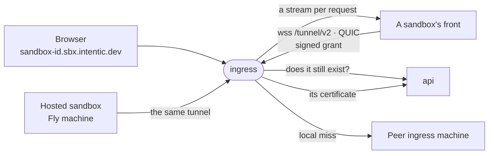

# ingress

The edge every sandbox hostname points at: it terminates TLS for them and carries browser traffic down the tunnels sandboxes dial, hosted ones included, over TCP or QUIC.


```mermaid
flowchart LR
    browser["Browser<br/>sandbox-id.sbx.intentic.dev"] --> ingress(["ingress"])
    front["A sandbox's front"] -- "wss /tunnel/v2 · QUIC<br/>signed grant" --> ingress
    ingress -- "a stream per request" --> front
    hosted["Hosted sandbox<br/>Fly machine"] -- "the same tunnel" --> ingress
    ingress -- "does it still exist?" --> api["api"]
    ingress -- "its certificate" --> api
    ingress -- "local miss" --> peer["Peer ingress machine"]
```

- A Rust crate that builds the same [tunnel](../../_sandbox/front/crates/tunnel) and [relay](../../_shared/relay)
  crates as the sandbox's front, so both ends of a tunnel are one implementation of the wire and of how HTTP crosses
  it.
- No database and nothing durable: the tunnel registry is an in-memory map, so a restart drops every tunnel and each
  front redials. One copy of a sandbox holds it (2026-10-05): a front names its instance on every tunnel
  (`x-intentic-instance`, `x-intentic-host`, and in the QUIC hello), and a tunnel from another instance than one
  holding the sandbox whose carrier was heard within the dead window, here or on a peer, is refused: 409 naming the
  holder in `x-intentic-holder`, `Hello::HeldElsewhere` over QUIC, or close code 4009 when the two registered at once.
  The same instance's newer tunnel displaces its older one (4001), and so does a new instance from the very place the
  holder names (`x-intentic-host`, machine and environment): one engine cannot run two copies of a sandbox, so that is
  the same container started again after a crash or a recreate, and refusing it would leave the sandbox unreachable
  for the refusal's backoff. A front naming no instance (older than this) keeps newest-wins either way, for the roll.
  Before this, two containers holding one grant took the tunnel from each other every minute.
- Holds only the platform's Ed25519 public key, so it verifies grants and can never mint one. Revocation is a
  cached, fail-open `GET /api/reachability/<id>` to the api, at registration, on a miss, and for every held sandbox
  as its minute-long cached answer expires (eight at a time). A 404 there is a deletion record and nothing else: the
  api answers 200 (`known: false`) for an id it has no record of either way, so an api reading a database that forgot
  a sandbox does not take it off the edge (2026-10-02). A held sandbox found deleted has every tunnel closed with code
  4010, and its front stops dialling; a redial is refused 403 with the `unknown-sandbox` verdict (2026-10-05: a deleted
  sandbox stayed reachable until its front redialled). The cache holds at most 10,000 answers, past which a new one is
  not kept.
- Routes on each request's Host, since HTTP/2 coalesces many hostnames onto one connection. A sandbox with no tunnel
  answers 502 with an `x-intentic-edge` header naming why (`edge-verdict.ts` in the contract), which the editor reads.
- What the edge serves beyond HTTPS over TCP is declared, never probed for: binding the QUIC door
  (`INGRESS_QUIC_PORT`) is what makes it answer every tunnel's upgrade with `x-intentic-transports: quic, h3,
  webtransport` and list the same under `transports` on `/health`. Undeclared means not served, which is what every
  older edge says.
- A tunnel is a carrier of byte streams, and the edge opens one per request, carrying plain HTTP/1.1 so an upgrade is
  itself (`session.rs`, `relay::exchange`). A front dials two WebSockets at `/tunnel/v2`, `interactive` and `bulk`,
  each carrying yamux, and a QUIC connection beside them once the edge's answer declares `quic`; QUIC is preferred while
  held, and there a stream that sends a megabyte without pausing yields to the others until it pauses.
- Over TCP, streams on one connection still share its congestion window and its losses, so a transfer rides the bulk
  socket: any preview's request, and a daemon route the front announced on its upgrade (`x-intentic-bulk`, the daemon's
  RouteMeta `lane`). The edge compiles in no route table, so a route's socket follows the daemon that serves it.
- Fronts that predate `/tunnel/v2` still dial `/tunnel/v1`, two lanes each an h2 session, an upgrade carried as a
  CONNECT whose h1 head rides under `x-ingress-*`. [legacy.rs](src/legacy.rs) alone speaks it, reading those fronts'
  transfer routes from the list frozen with the door, and goes once no front dials it.
- A `/tunnel/v2` front pings its WebSockets every 15 s and the edge only listens; either end drops a peer silent for
  45 s, checked in a task of its own so a stalled write cannot postpone it (2026-10-05). On `/tunnel/v1` the edge pings
  too, because some older fronts never ping and only answer: an edge that stopped pinging them dropped each one for
  silence every minute (`Door::liveness` in src/edge.rs). A QUIC connection's own keep-alive and idle timeout run on
  the same cadence, and since they prove only that packets cross, the edge proves the connection serves streams
  (2026-10-05: a half-dead QUIC path kept every request, since QUIC outranks the socket): a probe stream at
  registration, which must be answered before QUIC takes a request, then every 15 s with 10 s to answer, any answer
  counting (an older front answers HTTP 400). An unanswered probe closes the connection with code 4008 and the socket
  carries on while the front redials. A request whose QUIC stream does not open within 5 s, or whose answer has not
  started in 10 s while a probe beside it goes unanswered, demotes QUIC the same way and is sent once more over the
  socket when nothing of it was spent (no upgrade, no body). A QUIC front that named itself is registered only once it
  acknowledged the edge's `Held`, so a connection its front gave up on is never held.
- With the certificate held here (below), browsers get HTTP/3 on the same port, and the editor's terminals ride
  WebTransport where the platform relays the edge's declaration on the sandbox's row: a session opened at
  `/system/transport` on a sandbox's address, each stream served as one HTTP/1.1 connection to that address whatever
  Host it writes. The editor speaks a plain WebSocket on the stream, so any front or daemon serving `/system/terminal`
  serves it.
- Machines behind the one address find each other through Fly's internal DNS and forward a miss once to whichever
  holds the tunnel, over private port 8081. Every slot is news to the peers (a sandbox held only over QUIC on another
  machine is that machine's to answer, not `no-tunnel`), each with when it registered and which front instance dialled
  it: an `add` older than this machine's own registration in that slot is stale and ignored rather than displacing the
  newer one, and between two copies of one sandbox the first to register holds it on every machine (2026-10-05). An
  older peer's message carries socket ids alone and still reads newest-wins.
- A hosted sandbox is no exception: its machine dials the same tunnel with a grant the platform put in its config,
  and nothing else reaches it. One holding no tunnel (stopped, booting) answers the `no-tunnel` verdict, and the
  editor wakes it through the api. The edge replays nothing: no Fly HTTP proxy sits in front of 443 to act on one.

## Key files

- [src/edge.rs](src/edge.rs) — the tunnel door, the grant check, per-request Host routing and verdicts.
- [src/session.rs](src/session.rs) — one held tunnel: a carrier of streams, each one HTTP/1.1 exchange.
- [src/cluster.rs](src/cluster.rs) — which peer holds which tunnel, the holds protocol and the one-hop rule.
- [src/quic.rs](src/quic.rs) — the UDP door: a front's QUIC tunnel or a browser's HTTP/3, told apart by ALPN.
- [src/webtransport.rs](src/webtransport.rs) — a browser's session and its streams, pinned to the session's sandbox.
- [src/config.rs](src/config.rs) — every setting and its env var.

## Commands

```sh
cargo test                                        # every suite, over real sockets
pnpm --filter @intentic/ingress docker:release    # the image, the tunnel, browser-wire and relay crates as build contexts
```

## Deploying

The edge runs on Fly as `intentic-ingress`, apart from the Komodo stack that holds the api and web, and terminates TLS
itself ([fly.toml](fly.toml)): Fly passes raw TCP on 443 through with a PROXY v2 header naming the browser, and UDP 443
straight to the QUIC door, and the process presents the wildcard certificate the platform issues (the api's
`edge-certificate.ts`, fetched with `INGRESS_PLATFORM_TOKEN`). Fly holds no certificate for `*.sbx.intentic.dev`.

On a push to main, CI's `images-platform` job pushes `ghcr.io/intentic/ingress` and runs
[deploy-ingress.sh](../../_tools/scripts/platform/deploy-ingress.sh), which runs `flyctl deploy` with `fly.toml` and
waits until `/health` reports the build baked into the image, lists the tunnel door this checkout's fronts dial, and
declares `quic`, `h3` and `webtransport`. It refuses a config of the proxy shape unless told `INGRESS_EDGE_MODE=proxy`,
and its last line is the one to look for in CI's log: `edge-mode: tls — intentic-ingress declares quic, h3 and
webtransport`. An empty `FLY_API_TOKEN` skips it (`No FLY_API_TOKEN — skipping the edge deploy`); the Actions secret
is a deploy token scoped to the app, `fly tokens create deploy -a intentic-ingress`. Without it, roll by hand once the
image is pushed: `bash _tools/scripts/platform/deploy-ingress.sh` with `FLY_API_TOKEN` in the environment.

What the script does not set:

```sh
fly scale count 1 --region <region> -a intentic-ingress    # regions live here, not in fly.toml
fly secrets set -a intentic-ingress INGRESS_PUBLIC_KEY="$(openssl pkey -in ingress-key.pem -pubout)" \
    PLATFORM_URL=https://api.intentic.dev INGRESS_PLATFORM_TOKEN=<the api's INGRESS_PLATFORM_TOKEN> \
    INGRESS_TLS_PORT=8443 INGRESS_PROXY_PROTOCOL=true \
    INGRESS_QUIC_PORT=443 INGRESS_QUIC_HOST=fly-global-services INGRESS_ALT_SVC='h3=":443"; ma=86400'
fly ips list -a intentic-ingress                           # a dedicated IPv4: Fly delivers UDP to no shared one
```

| Setting | Why |
| --- | --- |
| `INGRESS_PUBLIC_KEY` | Public half of the api's `INGRESS_SIGNING_KEY`; the process exits without it. |
| `PLATFORM_URL` | The api: asked whether a sandbox still exists, and where the certificate is fetched. **Required with the platform token**: without both, the TLS listener refuses to start. |
| `INGRESS_PLATFORM_TOKEN` | What the edge presents to fetch the certificate; the same value as the api's. |
| `INGRESS_TLS_PORT`, `INGRESS_PROXY_PROTOCOL` | 8443 behind PROXY v2 headers, which is where fly.toml's TCP 443 lands. |
| `INGRESS_QUIC_PORT`, `INGRESS_QUIC_HOST` | **443**, on `fly-global-services`. Fly rewrites only a UDP packet's address, never its port, so a QUIC door on any other port hears nothing (8443 left HTTP/3 silent at go-live until it became 443). |
| `INGRESS_ALT_SVC` | Advertises HTTP/3 on TCP answers, naming the public port. |

- Run one machine per region where sandbox owners are. `fly.toml` never auto-stops them, since a stopped machine
  drops every tunnel it holds.
- Every service is checked over TCP. An HTTP check on the plain service never reported through Fly's proxy at go-live
  (the deploy timed out "waiting for status update"), and `/health` stays readable over TLS for the script's read-back.
- `tests/fly_configs.rs` holds `fly.toml`'s services (PROXY v2 on 443 to 8443, the redirect on 80 to 8080, UDP 443 to
  443, TCP checks) and holds it equal to `fly.edge-proxy.toml` outside them.
- Never publish `INGRESS_INTERNAL_PORT` (8081): binding only the private address is the peer protocol's one lock.
- The edge pings `/tunnel/v1` fronts itself. Some older fronts never ping and only answer, and an edge that only
  listened dropped each one for silence every minute; that surfaced at go-live, when every restart met them.
- An edge serves both doors and lists them on `/health` (`"doors":["/tunnel/v1","/tunnel/v2"]`), and a front dials
  only `/tunnel/v2`, with no fallback. So no sandbox image moves onto a tag sandboxes pull (`latest` in CI's
  `images-merge`, `stable` in the release and in `rollback.yml`) until the live edge lists the door that image's front
  dials: [require-edge-door.sh](../../_tools/scripts/image/require-edge-door.sh) asks `/health`, waits up to 30 minutes
  in CI for the same push's edge roll, and fails closed. deploy-ingress.sh asks the same after every roll. A
  self-hosted deployment publishing its own images names its edge with `EDGE_HEALTH_URL`.

Checking a live edge:

```sh
EDGE=https://ingress.sbx.intentic.dev
curl -fsS $EDGE/health | jq '{build, doors, transports, tunnels}'   # transports ["quic","h3","webtransport"]
openssl s_client -connect ingress.sbx.intentic.dev:443 -servername ingress.sbx.intentic.dev </dev/null 2>/dev/null |
    openssl x509 -noout -issuer -enddate -fingerprint -sha256      # the platform's certificate, not Fly's
curl -sI $EDGE/health | grep -i alt-svc                              # h3=":443"
docker run --rm ymuski/curl-http3 curl -sI --http3-only $EDGE/health | head -1   # HTTP/3 200
flyctl logs -a intentic-ingress --no-tail | grep -E '"message":"(QUIC )?tunnel (registered|refused|closed)"' | tail
```

## Terminating TLS at the edge: done

The switch went live on 2026-09-26 and soaked for a day before phase 3b made its shape CI's `fly.toml`. What it took,
for a deployment doing the same:

- **The certificate.** The api orders one wildcard for the fleet (`*.sbx.intentic.dev` and `sbx.intentic.dev`) over
  DNS-01 in Cloudflare (`INTENTIC_CLOUDFLARE_API_TOKEN`, `INTENTIC_CLOUDFLARE_ZONE`) once it has
  `INGRESS_PLATFORM_TOKEN`, retries every six hours, and logs `edge certificate issued`. Fly's own DNS-01 delegation,
  the `_acme-challenge.sbx.intentic.dev` CNAME, had to go first, since while it exists the api cannot publish its TXT
  there. In production the api's compose is kept by hand in Komodo: the token is a secret variable there, and the
  stack's api `environment:` must map it (the repository's
  [docker-compose.yml](../../_tools/selfhost/platform/docker-compose.yml) does). Check the issued one with
  `curl -fsS -H "authorization: Bearer $TOKEN" https://api.intentic.dev/api/ingress/certificate | jq -r .certificate |
  openssl x509 -noout -subject -enddate`.
- **Every hosted machine dialling.** A hosted machine is reached only down its tunnel, so each needs an image with
  intentic-front (aa02061469 or later) and `INGRESS_URL` plus `SANDBOX_GRANT` in its config. The api's wake re-applies a
  machine's config when that pair is missing or stale, moving a stock machine onto today's `stable` (`wakeHosted`). An
  environment overlay built on an older base keeps its overlay and has no front to dial with: it answers `no-tunnel`
  until its owner rebuilds the environment.
- **The secrets and the dedicated IPv4** in the table above, staged (`flyctl secrets set --stage`) so the deploy that
  applied the new services applied them too.
- **The replay lane removed** (phase 3b). Replay was a header Fly's HTTP proxy acted on; with none in front of 443 the
  edge answers a hosted sandbox holding no tunnel `no-tunnel`, which the editor already woke on. `HOSTED_APP_PREFIX`,
  the `fly-replay` answers and `/health`'s `replay` field are gone from the edge (the field is dropped, not reported
  `false`; nothing reads it), the front door `hostedMachineConfig` gave every hosted machine is gone from the api, and so
  is the `app` in the api's reachability answer. A machine configured with the old front door keeps that Fly service
  and its check until its next config apply (a claim, restart, overlay or healing wake), which drops it. It is
  harmless meanwhile: the hosted apps have no public address, so the service is reachable only by a replay nothing
  sends, and its check probes only the daemon's own `/health`. Nothing has to clean it up.

## Rolling back

**Not one command any more.** The fallback shape is [fly.edge-proxy.toml](fly.edge-proxy.toml): Fly's HTTP proxy
terminating TLS on 443 in front of the plain listener, no UDP. It needs a certificate of Fly's own, which phase 3b
removed. In order:

1. Re-add Fly's certificate: `flyctl certs add '*.sbx.intentic.dev' -a intentic-ingress`, and in Cloudflare the
   `_acme-challenge.sbx.intentic.dev` CNAME to `sbx.intentic.dev.qe8e12d.flydns.net`. Wait for `flyctl certs show
   '*.sbx.intentic.dev' -a intentic-ingress` to say it is issued. The api's own renewal then fails on that name while
   the CNAME stands (it logs why); the certificate it already issued stays valid until it expires.
2. Deploy the fallback: `INGRESS_EDGE_MODE=proxy bash _tools/scripts/platform/deploy-ingress.sh
   _platform/ingress/fly.edge-proxy.toml`, which ends on `edge-mode: proxy`. Then `flyctl secrets unset -a
   intentic-ingress INGRESS_TLS_PORT INGRESS_PROXY_PROTOCOL INGRESS_QUIC_PORT INGRESS_QUIC_HOST INGRESS_ALT_SVC`, which
   restarts the machines once more. Fronts and editors stop reaching for UDP as soon as the edge stops declaring it.
3. Stop CI putting it back: until `fly.toml` is the proxy shape again, every push to main redeploys the TLS shape.
   Either swap the two files back or remove the `FLY_API_TOKEN` Actions secret.

Every sandbox that dials, hosted ones included, is reachable again after step 2: the edge serves tunnels the same way
behind Fly's proxy. What does not come back is replay, which only ever carried a hosted sandbox dialling nothing.
Restoring it means reverting phase 3b's edge and api changes, and even then only machines re-configured afterwards
carry a front door for it to reach. A stopped hosted sandbox still answers `no-tunnel`, and the editor still wakes it.
