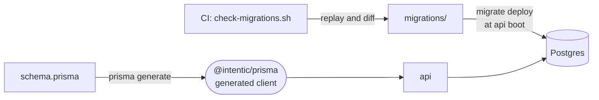

# prisma

The platform's Postgres schema, its append-only migration history and the Prisma client generated from them, shared as `@intentic/prisma`.



- Tables include Better Auth's users and sessions, sandboxes and their members, the hosted lane (machines, pool,
  builds, usage, plan), the wallet and admin stats. The comments in `schema.prisma` say what each column means.
- Migrations are append-only. `_tools/scripts/verify/check-migrations.sh` (CI's `migrations` job) fails when an
  applied migration changes, when a new one adds a `NOT NULL` column with no `DEFAULT`, or when replaying the history
  does not produce `schema.prisma`.
- The api image runs `migrate deploy` and then `migrate diff --exit-code` at boot, and stops if the live database
  differs from the schema baked into that image.
- `prisma.config.ts` loads the repo-root `.env` for `DATABASE_URL`; `build` generates with a placeholder URL, so
  building needs no database.

## Key files

- [schema.prisma](schema.prisma) — every table, with what each column is for.
- [prisma.config.ts](prisma.config.ts) — schema and migrations paths, resolved from this file wherever Prisma runs.
- [client.ts](client.ts) — re-exports the generated client as the package entry.
- [migrations/20260901190000_tunnel_id_backfill/migration.sql](migrations/20260901190000_tunnel_id_backfill/migration.sql) — a guarded forward fix, the model for the runbook below.

## Commands

```sh
pnpm db:up                                                   # repo root: local Postgres, migrations applied
pnpm --filter @intentic/prisma migrate:dev --name <change>   # after editing schema.prisma
pnpm --filter @intentic/prisma build                         # regenerate the client
bash _tools/scripts/verify/check-migrations.sh               # the CI migration rules, locally
```

## Failed migration

`Error: P3009` in the api log means a migration failed against that database once. Prisma then refuses every later
migration, so the api never boots and no redeploy clears it.

1. Find the Postgres error for the failed migration in the api log.
2. Leave its file alone. Write a new migration that completes the change on a table with rows, each statement
   guarded (`IF NOT EXISTS`, `WHERE … IS NULL`) so it changes nothing where the original applied. Land it on main.
3. Record the failed one as applied, from the api image against that database:

   ```sh
   docker run --rm -e DATABASE_URL ghcr.io/intentic/api:latest \
       bun node_modules/prisma/build/index.js migrate resolve --applied <failed_migration> \
       --config node_modules/@intentic/prisma/prisma.config.ts
   ```

4. Redeploy. The boot applies the new migration, and `migrate diff` confirms the database matches `schema.prisma`.

A boot that stops at `migrate diff` instead means the database has drifted from the migrations; the logged diff says
where.
