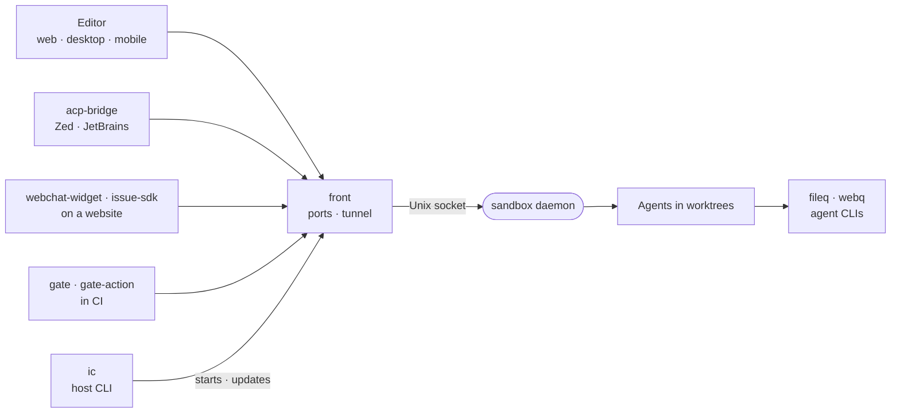

# The sandbox

One private box per project where the code and its coding agents live, owned by the `sandbox` daemon and reached from the editor, CI, websites and the user's devices.

| Package | Role |
| --- | --- |
| [acp-bridge](acp-bridge) | `intentic-acp`: drive sandbox agents from Zed, JetBrains or any ACP editor |
| [fileq](fileq) | Agent CLI reading binary files (docx, pdf, images, archives) as budgeted markdown |
| [front](front) | Rust network edge: owns every port and the tunnel, supervises the daemon |
| [gate](gate) | `intentic-gate`: a CI pipeline waits on a release gate's verdict |
| [gate-action](gate-action) | GitHub Action: wait on a release gate or wake an automation |
| [ic](ic) | Rust host CLI: run, update and repair sandboxes, runners and deploy targets |
| [issue-sdk](issue-sdk) | Bug reporter a site embeds to send crashes to a sandbox agent |
| [sandbox](sandbox) | The daemon: runs agents in worktrees, serves the workspace, lands their work |
| [scaffold](scaffold) | Intent-repo skeleton, git verbs and `deploy.config` rendering for CLI and daemon |
| [webchat-widget](webchat-widget) | Visitor chat widget a site embeds to talk to a sandbox agent |
| [webq](webq) | Agent CLI fetching web pages as budgeted markdown, with bounded crawls |
| [workspace-setup](workspace-setup) | Picks a project's dependency manager from its manifest and lockfile names |
