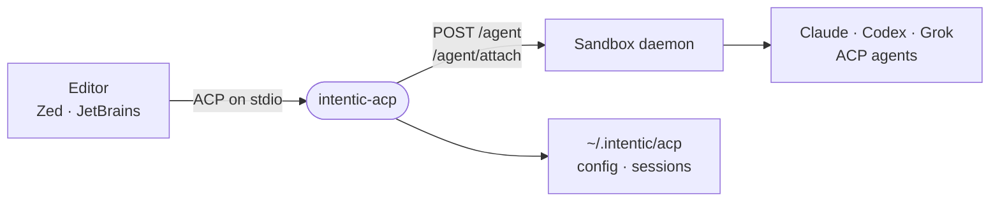

# acp-bridge

A stdio bridge that lets Zed, JetBrains or any Agent Client Protocol editor drive the agents in an intentic sandbox.



- Runs on the user's machine: the editor launches `npx @intentic/acp-bridge` (bin `intentic-acp`) and talks ACP over
  stdin and stdout, so nothing else may write to stdout.
- One ACP session is one daemon conversation. `POST /agent` starts a turn, `/agent/attach` streams it back, and
  `translate.ts` turns each frame into a `session/update`, rewriting `/work` paths onto the editor's cwd. Open the
  synced folder as the project so those paths line up.
- A plan card and each `AskUserQuestion` become ACP permission requests. The `code` and `plan` modes map to the
  daemon's per-turn permission mode.
- Credentials come from `INTENTIC_SANDBOX_URL` and `INTENTIC_CONTROL_TOKEN`, or from `intentic-acp login`. The token
  is an editor-scoped control token minted in the sandbox app; a 401 reaches the editor as ACP `auth_required`.
- [agent-registry/agent.json](agent-registry/agent.json) is the listing for ACP agent registries.

## Key files

- [src/cli.ts](src/cli.ts) — entry point: `login`, or serve ACP on stdio.
- [src/bridge.ts](src/bridge.ts) — `bridgeAgentApp`: sessions, modes, and plans and questions as permission requests.
- [src/translate.ts](src/translate.ts) — attach frames to `session/update`, sandbox paths to editor paths.
- [src/daemon-client.ts](src/daemon-client.ts) — the daemon routes the bridge calls, with the control-token header.
- [src/config.ts](src/config.ts) — environment-then-file config and the ACP session to conversation map.
- [src/bridge.integration.test.ts](src/bridge.integration.test.ts) — the whole bridge against a fake daemon.

## Commands

```sh
pnpm --filter @intentic/acp-bridge test
```
