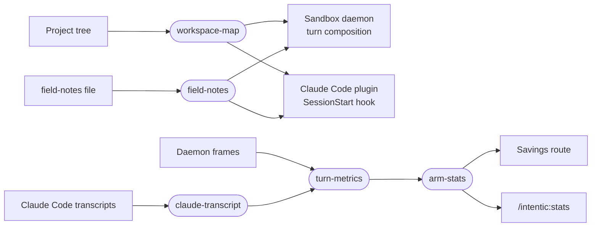

# agent-context

What a coding agent is told as a session opens, and the per-session readings that show whether it helped, shared by the sandbox daemon and the Claude Code plugin.



- Runtime-neutral on purpose: nothing here knows the daemon's event shapes, settings or state paths. The daemon adapts
  its frames onto `createTurnMetrics` and passes its own notes path; the plugin does the same from hook payloads and
  `~/.claude/projects`.
- `workspace-map` recomputes a project's areas from the filesystem every time (2,800-character ceiling);
  `field-notes` slices a ranked TOON brief to a budget, and `field-notes-prompt` is the brief both writers of that
  file are given, so the writer and the reader cannot drift apart.
- `experiments` draws a conversation's arm from a salted hash of its id, `turn-metrics` scores one turn's tool calls
  (searches, orientation listings, calls before the edited file, failures), and `arm-stats` compares the two arms of
  each mechanism with a Welch margin that withholds a delta until it is real.
- `claude-transcript` reads a Claude Code session, subagents included, into the same turns and calls, so the
  sandbox's benches and the plugin's report count identically. Which user line a person wrote (a prompt, a slash
  command, or a compaction summary, an interruption, a harness line) is `@intentic/iq/transcript`'s `promptOf`, the
  classification iq's session recall reads too, so the two readers cannot disagree on where a turn starts.
  - 2026-10-06: `iq sessions` keeps its own line reader of the same files (`_search/iq/src/recall/transcript/lines.ts`)
    rather than this one. `iq` is published to npm and this package is not, so `iq` cannot depend on it, and the two
    share only the test for "a person sent this prompt": this one reads turns of tool calls, that one per-line fields
    (uuid chains to fork at, file touches from three line kinds, titles). They also disagree on that test: a compaction
    summary starts a turn there but not here, a slash command's `<command-…>` echo starts one here but not there, and
    an image-only prompt starts one here only. Making either the other's reader changes what one of them counts, so it
    waits on deciding which answer is right.
- `guidance` holds the working-guidance paragraphs that hold outside the sandbox; the daemon's guidance registry
  takes them word for word, so its experiment cohort did not move when they came here.

## Key files

- [src/workspace-map.ts](src/workspace-map.ts) — the project map: area discovery, purposes, and the budgeted render.
- [src/field-notes.ts](src/field-notes.ts) — reads a field-notes file by rank, never re-encoding it.
- [src/turn-metrics.ts](src/turn-metrics.ts) — the per-turn call ledger every reading is taken from.
- [src/arm-stats.ts](src/arm-stats.ts) — which readings judge which mechanism, and the two-arm arithmetic.
- [src/claude-transcript.ts](src/claude-transcript.ts) — Claude Code session files as turns of tool calls.
- [src/tool-calls.ts](src/tool-calls.ts) — display names, tool kinds, and the search, listing and file-work predicates.

## Commands

```sh
pnpm --filter @intentic/agent-context test
```
