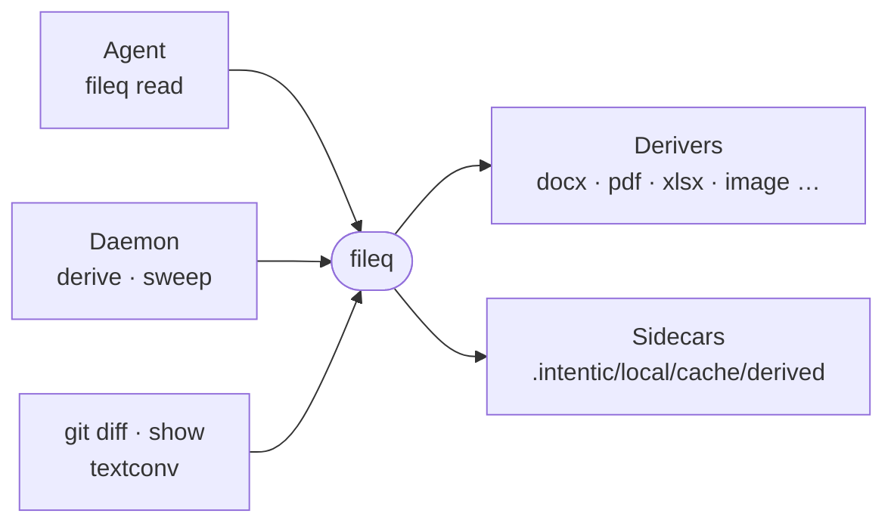

# fileq

A CLI that shows an agent the contents of binary workspace files (Office documents, PDFs, images, audio, archives) as budgeted markdown, cached as sidecars.



- An agent cannot `cat` a docx or the text layer of a PDF. `fileq <file>` prints a capsule line (title, format,
  token cost, derived or fresh), then the markdown clipped to `--budget` tokens, and names the sidecar that holds the
  whole text.
- Each derivable file gets one sidecar at `.intentic/local/cache/derived/<path>.md`. It is fresh while the source's
  sha256 and the deriver's version stamp both match, so reading a file twice derives it once. Text is neutralized at
  write time, because a sidecar is later read as a plain file.
- The daemon keeps sidecars converged in the background with `fileq derive` and `fileq sweep`
  (`_sandbox/sandbox/src/derived/`), and imports `./formats` and `./sidecar` so both sides agree on what is derivable.
- In the sandbox image, `git diff` and `git show` on a document print its text through `fileq read --plain`, wired by
  `fileq git-attributes`.
- Out of scope: plain text files (read them directly), web pages ([webq](../webq)), OCR and transcription.

## Usage

```sh
fileq report.docx                    # capsule + markdown up to 4000 tokens, whole text saved
fileq read deck.pptx --budget 8000   # a bigger slice on stdout
```

## Key files

- [src/app.ts](src/app.ts) — the command routes and the `--help` text an agent reads.
- [src/lib/derive.ts](src/lib/derive.ts) — `ensureSidecar`: the pipeline `read`, `derive` and `sweep` all run.
- [src/lib/formats.ts](src/lib/formats.ts) — `detectFormat`: magic bytes first, extension as fallback.
- [src/lib/sidecar.ts](src/lib/sidecar.ts) — sidecar paths, front matter and the freshness rule.
- [src/lib/derivers/deriver.ts](src/lib/derivers/deriver.ts) — the contract every format handler meets.
- [src/derivers.integration.test.ts](src/derivers.integration.test.ts) — each format's output, by fixture.

## Commands

```sh
pnpm --filter @intentic/fileq test
```
