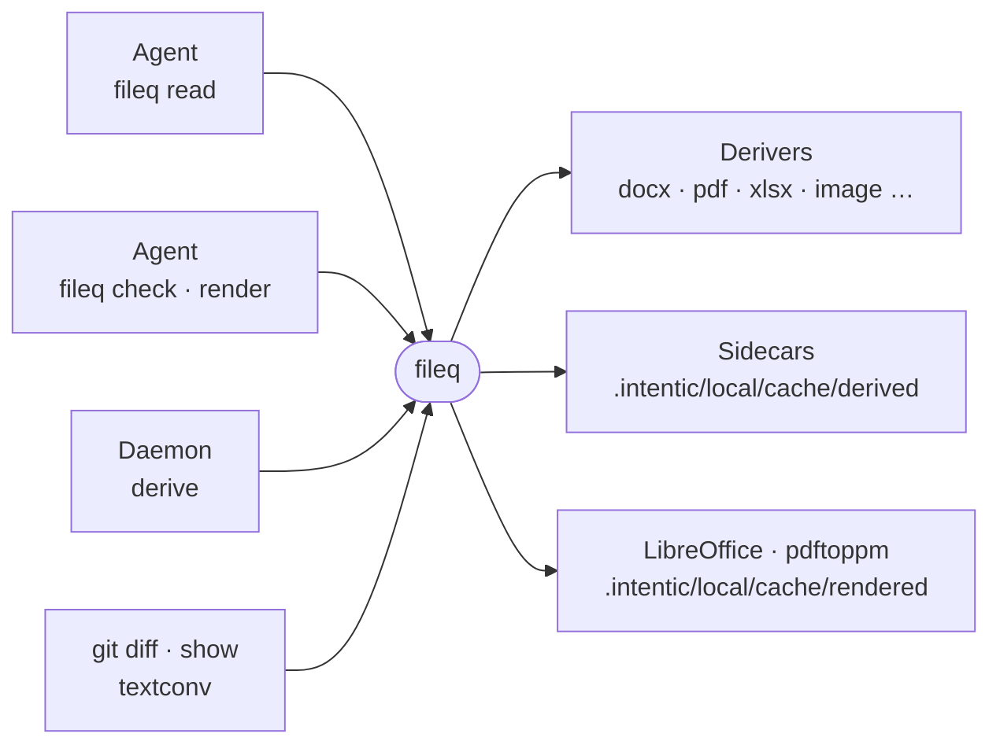

# fileq

A CLI that shows an agent the contents of binary workspace files (Office documents, PDFs, images, audio, archives) as budgeted markdown, cached by content, and checks and draws the documents an agent makes.


```mermaid
flowchart LR
    agent["Agent<br/>fileq read"] --> fileq(["fileq"])
    maker["Agent<br/>fileq check · render"] --> fileq
    daemon["Daemon<br/>derive"] --> fileq
    git["git diff · show<br/>textconv"] --> fileq
    fileq --> derivers["Derivers<br/>docx · pdf · xlsx · image …"]
    fileq --> sidecars["Sidecars<br/>.intentic/local/cache/derived"]
    fileq --> tools["LibreOffice · pdftoppm<br/>.intentic/local/cache/rendered"]
```

- An agent cannot `cat` a docx or the text layer of a PDF. `fileq <file>` prints a capsule line (title, format,
  token cost, derived or fresh), then the markdown clipped to `--budget` tokens, and names the file that holds the whole
  text.
- Renderings are cached by content: keyed by the source's sha256 and the deriver's version stamp, never its path, so
  a repeat read of unchanged content is instant, whether it is the same file, a copy or a move of it, or a file
  outside the workspace. The entries live under `.intentic/local/cache/derived/.by-hash/`, or with no workspace under
  `by-hash/` in `$FILEQ_HOME`, else `$XDG_CACHE_HOME/fileq`, else `~/.cache/fileq`. A cache that cannot be written costs the speed-up,
  never the read.
- A workspace file also gets a sidecar at `.intentic/local/cache/derived/<path>.md`, fresh while its sha256 and the
  stamp both match. Text is neutralized at write time, because a sidecar or a cache entry is later read as a plain
  file.
- The daemon renders one file when asked with `fileq derive --json <path>` (`_sandbox/sandbox/src/derived/`), and
  imports `./formats` and `./sidecar` so both sides agree on what is derivable.
- In the sandbox image, `git diff` and `git show` on a document print its text through `fileq read --plain`, wired by
  `fileq git-attributes`.
- `fileq check <file>` lints a docx, pptx, xlsx or pdf an agent produced and names each problem where a reader meets
  it (`slide 3 · "Title 1"`, `'Q3 plan'!C4`, `page 7`, `paragraph 12 · "…"`). An error is a fact read off the
  structure (a missing image, a cell showing `#REF!`, a link to a bookmark that is not there, a blank page, Office's
  own "Click to add title" left as text) and makes it exit 1; a warning is a judgement call or an estimate (text
  overflowing its box, from average glyph widths). Some rules are adapted from SurfSense's artifact verification
  (Apache-2.0); [NOTICE](NOTICE) names them.
- `fileq render <file>` draws pages or slides to PNG under `.intentic/local/cache/rendered/<path>/` (or `--out`) and
  prints their paths for an image reader. Office formats go through LibreOffice to PDF first, keeping hidden slides
  so slide N is image N; `pdftoppm` or `mutool` draws the PDF. A render is keyed by the document's hash, so an
  unchanged file answers from the last one. A missing tool exits 2 with what installs it.
- Its skill ([src/skill.ts](src/skill.ts)) tells an agent to check and look at every document it makes, with short
  authoring rules adapted from SurfSense's document skills ([src/skill-authoring.ts](src/skill-authoring.ts)).
- Out of scope: plain text files (read them directly), web pages ([webq](../webq)), OCR and transcription.

## Usage

```sh
fileq report.docx                    # capsule + markdown up to 4000 tokens, whole text saved
fileq read deck.pptx --budget 8000   # a bigger slice on stdout
fileq check deck.pptx                # problems by slide and drawing; exit 1 on an error
fileq render deck.pptx --pages 1-3   # slide-1.png … slide-3.png, one path per line
```

2026-09-29: rendering shells out to LibreOffice and poppler instead of bundling a renderer. pdf.js draws only onto a
canvas fileq does not carry, and an office layout faithful enough to judge overflow is LibreOffice itself. No published sandbox
image carries them: they are the opt-in `office` pack (`_sandbox/sandbox/image-packs/office.Dockerfile`, ~335 MB), so
there `fileq render` names the missing tool and prints `environment propose office --pack`, which asks the owner for it.

## Key files

- [src/app.ts](src/app.ts) — the command routes and the `--help` text an agent reads.
- [src/lib/derive.ts](src/lib/derive.ts) — `ensureSidecar` and `renderByContent`: the pipeline `read` and `derive` both run.
- [src/lib/content-cache.ts](src/lib/content-cache.ts) — renderings keyed by content hash and deriver stamp.
- [src/lib/formats.ts](src/lib/formats.ts) — `detectFormat`: magic bytes first, extension as fallback.
- [src/lib/sidecar.ts](src/lib/sidecar.ts) — sidecar paths, front matter and the freshness rule.
- [src/lib/check/check.ts](src/lib/check/check.ts) — `fileq check`: which formats have a checker; each format's rules sit beside it.
- [src/lib/render/render.ts](src/lib/render/render.ts) — `fileq render`: conversion, rasterizing and the render cache.

## Commands

```sh
pnpm --filter @intentic/fileq test
```
