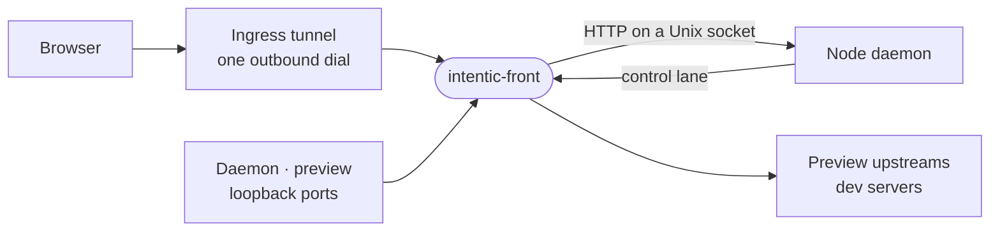

# front

The sandbox's network edge: a Rust binary that owns every port and the ingress tunnel, relays each request to the Node daemon or a preview, and keeps the daemon running.



- Runs as the container's main process. `docker-entrypoint.sh` execs `intentic-front -- node … main.js`, and the
  front starts Node as its child. A crash restarts Node with backoff while every listener and connection stays open;
  a clean exit or a refused config ends the front, and with it the container.
- `route.rs` picks the target from the listener a request arrived on and the leftmost DNS label of its Host. On the
  preview port and the tunnel, `sandbox-<id>` is Node and every other label is a preview. The label rules are held to
  the contract's shared `hostnames.fixture.json`.
- Reachability is one outbound WebSocket (`tunnel.rs`) that presents the sandbox's grant and then serves HTTP/2 over
  it. It never gives up, because it is the only way in.
- Node drives the front over the control lane: length-prefixed JSON frames on a Unix socket that push listen config
  and certificates. [crates/front-wire](crates/front-wire) defines the frames, and its tests write the TypeScript the
  daemon's `front-link.ts` imports from `@intentic/sandbox-contract`.

## Key files

- [crates/front/src/main.rs](crates/front/src/main.rs) — startup: run directory, sockets, listeners, tunnel, supervisor.
- [crates/front/src/route.rs](crates/front/src/route.rs) — which side answers a request.
- [crates/front/src/supervise.rs](crates/front/src/supervise.rs) — runs Node, restarts it, reaps orphans as PID 1.
- [crates/front/src/tunnel.rs](crates/front/src/tunnel.rs) — the ingress tunnel: grant, then HTTP/2 over a WebSocket.
- [crates/front-wire/src/lib.rs](crates/front-wire/src/lib.rs) — the control-lane frame types, the lane's only definition.
- [crates/front/tests/routes.rs](crates/front/tests/routes.rs) — the real binary on real ports: routing, preview relay, TLS, upgrades.

## Commands

```sh
(cd _sandbox/front && cargo test)          # front-wire's tests also rewrite the TypeScript wire types
bash _tools/scripts/image/build-front.sh   # the binary for the sandbox image
```
