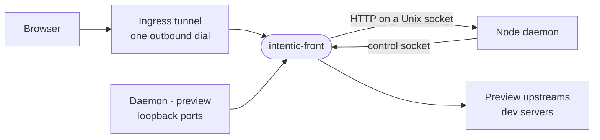

# front

The sandbox's network edge: a Rust binary that owns every port and the ingress tunnel, relays each request to the Node daemon or a preview, and keeps the daemon running.


```mermaid
flowchart LR
    browser["Browser"] --> tunnel["Ingress tunnel<br/>one outbound dial"]
    tunnel --> front(["intentic-front"])
    ports["Daemon · preview<br/>loopback ports"] --> front
    front -->|"HTTP on a Unix socket"| node["Node daemon"]
    front --> preview["Preview upstreams<br/>dev servers"]
    node -->|"control socket"| front
```

- Relays with the edge's own code: the [relay](../../_shared/relay) crate (one exchange over any stream, one reading
  of a host, one list of hop-by-hop headers) and the tunnel crate are built by both.
- Runs as the container's main process. `docker-entrypoint.sh` execs `intentic-front -- node … main.js`, and the
  front starts Node as its child. A crash restarts Node with backoff while every listener and connection stays open;
  a clean exit or a refused config ends the front, and with it the container.
- Daemon replies expose Resource Timing to the origin their CORS response already permits, so the editor can read the
  negotiated HTTP protocol and reserve browser connections when multiplexing is unavailable.
- `route.rs` picks the target from the listener a request arrived on and the leftmost DNS label of its Host. On the
  preview port and the tunnel, `sandbox-<id>` is Node and every other label is a preview. The label rules are held to
  the contract's shared `hostnames.fixture.json`.
- Reachability is the front's own dial (`tunnel.rs`): two WebSockets at `/tunnel/v2`, `interactive` and `bulk`, each
  presenting the sandbox's grant and the daemon's transfer routes and then carrying yamux, and a QUIC connection beside
  them (`quic.rs`), dialled only once the edge's answer declares `quic` (`x-intentic-transports`). Either way the edge
  opens a stream per request, and the front serves every stream as one HTTP/1.1 connection (`Front::serve_stream`), an
  upgrade included. A transfer rides the bulk socket over TCP and yields by itself over QUIC, so it never queues a
  keystroke. It never gives up, because it is the only way in. The front pings its sockets; QUIC keeps itself alive.
- Terminals are the front's own: `GET /system/terminal` never reaches Node's HTTP. Node answers once what a socket may
  open, and the front serves it with one `tmux -C` client per session shared by every viewer; one that falls behind
  gets a snapshot instead of a backlog. A terminal is a WebSocket however it arrives: a browser's over TCP, or one the
  editor speaks on a WebTransport stream, which the edge relays as the same HTTP/1.1 upgrade.
- The sandbox's proof of life is the front's too: `GET /system/vitals` on the daemon's host (`vitals.rs`) is answered
  before anything waits for Node, whether Node has not said hello yet, is up, or is being restarted. It reports Node's
  link (`starting`, `up`, `restarting`), its lag, how many times the front restarted it in the last 10 minutes, the
  container's uptime, and cgroup v2's `some avg10` pressure for cpu, memory and io. The lag is the round trip of a
  `ping` the front sends over the control socket every 2 s once the previous one was answered, or how long the
  outstanding one has waited when that is longer, and Node answers it in the link itself. Any origin may read the
  answer and nothing may cache it, since it carries nothing of the workspace. (2026-09-30: the editor's only liveness
  signal was the heartbeat on Node's `/events` stream, which Node's event loop sends, so a sandbox starved by a build
  or by swap read as a dead one.)
- The change feed: the front keeps a generation per checkout Node reads git in, moved by one inotify instance on
  whatever a `git status` there reads, so Node answers an untouched checkout from memory.
- Node drives the front over the control socket: length-prefixed JSON frames on a Unix socket that push listen config
  and certificates, and either side asks the other a question under one envelope (an id, an answer or a refusal, five
  seconds' patience; the front's `ping` waits as long as its connection lasts). A reply the front cannot read refuses
  its own question and leaves the link up, which is how an older Node answers a question it does not know. The front
  owns every socket and byte, Node every decision about them: which terminal a socket
  opens onto (the front composes tmux's command), and what becomes of a preview request (an upstream to relay, a page
  to write, or the outbox to hand back), decided once when asked. [crates/front-wire](crates/front-wire) defines the frames, and nothing a browser sees;
  [crates/browser-wire](crates/browser-wire) defines what one does (the terminal's messages, the vitals, the
  WebTransport path, the edge's verdict), and the edge builds it too. Each crate's tests, and the tunnel crate's, write their TypeScript
  and a JSON manifest into `@intentic/sandbox-contract`, whose `contract.lock.json` pins the manifests.

## Key files

- [crates/front/src/route.rs](crates/front/src/route.rs) — which side answers a request.
- [crates/front/src/supervise.rs](crates/front/src/supervise.rs) — runs Node, restarts it, reaps orphans as PID 1.
- [crates/front/src/tunnel.rs](crates/front/src/tunnel.rs) — the ingress tunnel: grant, then a stream per request.
- [crates/front/src/term/mod.rs](crates/front/src/term/mod.rs) — a terminal socket from Node's plan to its close.
- [crates/front-wire/src/lib.rs](crates/front-wire/src/lib.rs) — the control socket's frames, their only definition.
- [crates/front/tests/routes.rs](crates/front/tests/routes.rs) — the real binary on real ports: routing, preview relay, TLS, upgrades.

## Commands

```sh
(cd _sandbox/front && cargo test)          # the wire crates' tests also rewrite the contract's generated/ files
bash _tools/scripts/image/build-front.sh   # the binary for the sandbox image, _shared/relay passed beside it
```
